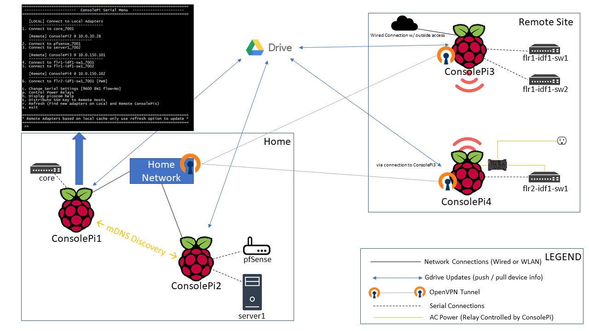
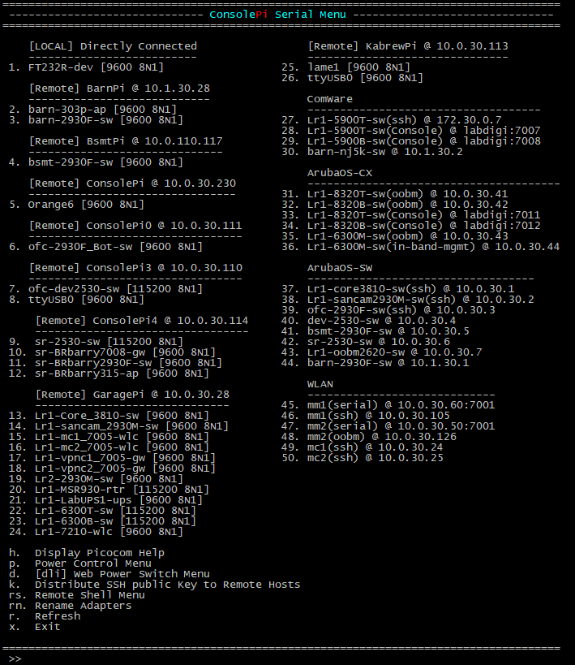
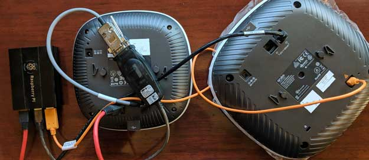
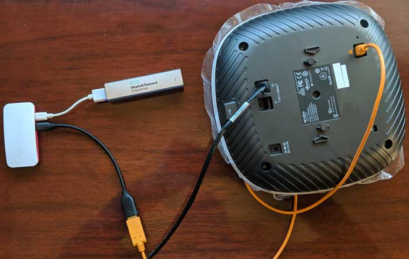

# ConsolePi

Acts as a serial Console Server, allowing you to remotely connect to ConsolePi via Telnet/SSH/bluetooth to gain Console Access to devices connected to local **or remote** ConsolePis via USB to serial adapters (i.e. Switches, Routers, Access Points... anything with a serial port).  

*Check out the **NEW** [ConsolePi Clustering Feature](#consolepi-cluster--cloud-config)!!*

***TL;DR:***
Single Command Install Script. Run from a RaspberryPi running raspbian (that has internet access):

```
sudo wget -q https://raw.githubusercontent.com/Pack3tL0ss/ConsolePi/master/installer/install.sh -O /tmp/ConsolePi && sudo bash /tmp/ConsolePi && sudo rm -f /tmp/ConsolePi
```
------
# Contents
 - [Features](#features)
     - [Serial Console Server](#serial-console-server)
     - [AutoHotSpot](#autoHotSpot)
     - [Automatic VPN](#automatic-openvpn-tunnel)
     - [Automatic PushBullet Notifications](#automatic-pushbullet-notification)
     - [Clustering / Cloud Sync](#consolepi-cluster--cloud-config)
         - [Supported Cluster Methods](#supported-cluster-sync-methods)
             - [Google Drive](#google-drive)
             - [mDNS](#mdns)
             - [Manual](#local-cloud-cache)
          - [How it works](#how-it-works)
          - [Important Notes](#important-notes)
      - [API](#api)
 - [Installation](#installation)
     - [Automated Installation](#1-automated-installation)
     - [Semi-Automatic Install](#2-semi-automatic-install)
     - [Automated Flash Card Imaging/prep](#3-automated-flash-card-imaging-with-auto-install-on-boot)
 - [ConsolePi Usage](#consolepi-usage)
     - [Configuration](#configuration)
     - [Console Server](#console-server)
         - [TELNET](#telnet)
         - [SSH / BlueTooth (`consolepi-menu`)](#ssh--bluetooth)
      - [Convenience Commands](#convenience-commands)
      - [Upgrading ConsolePi](#upgrading-consolepi)
 - [Tested Hardware](#tested-hardware)
 - [ConsolePi @ Work! (Image Gallery)](#consolepi-@-work)
 - [Credits](#credits)
------

# Features

## **Serial Console Server**
This is the core feature of ConsolePi.  Connect USB to serial adapters to ConsolePi, then access the devices on those adapters via the ConsolePi.  Supports TELNET directly to the adapter, or connect to ConsolePi via SSH or BlueTooth and select the adapter from the menu.  A menu is launched automatically when connecting via BlueTooth, use `consolepi-menu` to launch the menu from an SSH connection.  The menu will show connection options for any locally connected adapters, as well as connections to any remote ConsolePis discovered via Cluster/sync.

## **AutoHotSpot**

Script runs at boot (can be made to check on interval via Cron if desired).  Looks for pre-defined SSIDs, if those SSIDs are not available then it automatically goes into hotspot mode and broadcasts its own SSID.  In HotSpot mode user traffic is NAT'd to the wired interface if the wired interface is up.

When ConsolePi enters hotspot mode, it first determines if the wired port is up and has an IP.  If the wired port is *not* connected, then the hotspot distributes DHCP, but does not provide a "Default Gateway" to clients.  This allows a user to dual connect without having to remove a route to a gateway that can't get anywhere.  I commonly use a second USB WLAN adapter to connect to ConsolePi, while remaining connected to the internet via a different SSID on my primary adapter.

> If a domain is provided to the wired port via DHCP, and the hotspot is enabled ConsolePi will distribute that same domain via DHCP to clients.

## Automatic OpenVPN Tunnel

When an interface receives an IP address ConsolePi will Automatically connect to an OpenVPN server under the following conditions:
- It's configured to use the OpenVPN feature, and the ConsolePi.ovpn file exists (an example is provided during install)
- ConsolePi is not on the users home network (determined by the 'domain' handed out by DHCP)
- The internet is reachable.  (Checked by pinging a configurable common internet reachable destination)

##  **Automatic PushBullet Notification**

*(Requires a PushBullet Account, API key, and the app / browser extension.)*

When ConsolePi receives a dynamic IP address.  A message is sent via PushBullet API with the IP so you know how to reach ConsolePi.


An additional message is sent once a tunnel is established if the Automatic OpenVPN feature is enabled.


Each Time a Notification is triggered all interface IPs are sent in the message along with the ConsolePi's default gateway(s).

## ConsolePi Cluster / Cloud Config

The Cluster feature allows you to have multiple ConsolePis connected to the network, or to each other (i.e. first ConsolePi in hotspot mode, the others connected as clients to that hotspot).  A connection to any one of the ConsolePis in the Cluster will provide options to connect to any local serial adapters, as well as those connected to the other ConsolePis in the cluster (via the `consolepi-menu` command).




**Another look at the menu**
*(No Power Relays defined in this one)*




### Supported Cluster Sync Methods:

#### Google Drive:
   > Read The [Google Drive Setup](readme_content/gdrive.md) for instructions on setting up Google Drive and authorizing ConsolePi to leverage the API.
 - Google Drive/Google Sheets is currently the only external method supported.  Given this gets the job done, it unlikely more external methods will be added.

 - The ConsolePi will automatically exchange information with `ConsolePi.csv` in your gdrive under the following scenarios (*all assume the function is enabled in the config*):
  1. When the ConsolePi receives an IP address, and can reach the google API endpoints.

  2. When consolepi-menu is launched and the `'r'` (refresh) option is selected.

  >In both of the above a local cloud cache is updated for the sake of persistence and speed.  The local cloud cache is what is referenced when the menu is initially launched

#### mDNS
* ConsolePis now advertise themselves on the local network via mDNS (bonjour, avahi, ...)

* 2 daemons run on ConsolePi one that registers itself via mdns and updates anytime a change in available USB-serial adapters is detected, and a browser service which browses for remote ConsolePis registered on the network.  The browser service updates the local cloud cache when a new ConsolePi is detected.

#### Local Cloud Cache
  - local cloud cache:  For both of the above methods, a local file `/etc/ConsolePi/cloud.data` is updated with details for remote ConsolePis.  This cache file can be modified or created manually.  If the file exists, the remote ConsolePis contained within are checked for reachability and added to the menu on launch.

#### DHCP based:

This function currently only logs as mDNS has made this unnecessary. It remains as future enhancements (auto detect oobm ports, ztp) will likely use this mechanism.

Triggered by ConsolePi Acting as DHCP server (generally hotspot):
  

###  Important Notes:

 - The Gdrive function uses the hostname as a unique identifier.  If all of your ConsolePis have the same hostname they will each overwrite the data.  The Hostname is also used to identify the device in the menu.

   **Make Hostnames unique for each ConsolePi**

 - The ```consolepi-addconsole``` command now supports assingment of custom names to the aliases used to identify the serial adapters when using the predictable TELNET ports. (udev rules).  If configured these names are used in ```consolepi-menu```, the default device name is used if not (i.e. ttyUSB0), but that's less predictable.

 - The last ConsolePi to connect is the only one that will have menu-items for all the connected ConsolePis on the initial launch of ```consolepi-menu```.  Use the refresh option in ```consolepi-menu``` if connecting to one of the previous ConsolePis so it can fetch the data for ConsolePis that came online after it did.

 - `consolepi-menu` does not attempt to connect to the cloud on launch, it retrieves remote data from the local cache file only, verifies the devices are reachable, and if so adds them to the menu.  To trigger a cloud update use the refresh option.  *Note that ConsolePi will automatically update the local cache file when it gets an IP address, so the refresh should only be necessary if other ConsolePis have come online since the refresh.*

 - Read The [Google Drive Setup](readme_content/gdrive.md) for instructions on setting up Google Drive and authorizing ConsolePi to leverage the API.

   ###### If you are configuring multiple ConsolePis to use this cluster, you should consider using the [Flash-Card imaging script](#3.-automated-flash-card-imaging-with-auto-install-on-boot).  Once You've installed the first ConsolePi, leverage the Automated flash-card imaging script to pre-stage the micro-sd cards for the other ConsolePis you will be creating.  This script is handy, if duplicating the install across multiple ConsolePis.  It can pre-stage the entire configuration and cut out some install time.

## ConsolePi API

 With the development of the short-lived DHCP sync function an API was created to speed up updates.  That API is now implemented and running... http (for now) port 5000 with the following URIs all start with /api/v1.0/ All current methods only support the GET method.  If a need arises to actually use this for something Security and post capability may follow.

/api/v1.0/
* adapters: returns list of local adapters
* remcache: returns the local cloud cache
* ifaces: returns interface / IP details
* details: full json representing all local details for the ConsolePi   

ConsolePi currently doesn't use the API for any of it's functionality.  It may be leveraged in the future for verification (to ensure cloud sync entry is not stale), or for other purposes yet to be determined.

> The API is currently unsecured, it uses http, and Auth is not implemented yet.  It currently only supports GET requests, and doens't return any sensitive data.  As it's not currently used, it's OK to disable `sudo systemctl disable consolepi-api`.  Just be aware that you may have to disable after each upgrade.

# Installation

If you have a Linux system available you can use the [Flash-Card imaging script](#3.-automated-flash-card-imaging-with-auto-install-on-boot)  to burn the image to a micro-sd, enable SSH, pre-configure a WLAN (optional), and PreConfigure ConsolePi settings (optional).  This script is especially useful for doing headless installations.

**The Following Applies to All Automated Installation methods**

ConsolePi will **optionally** use pre-configured settings for the following if they are placed in the logged in users home-dir when the installer starts (i.e. /home/pi) or in a 'ConsolePi_stage' subdir (i.e. /home/pi/ConsolePi_stage).  This is optional, the installer will prompt for the information if not pre-configured.  It will prompt you to verify either way.

- ConsolePi.conf: This is the main configuration file where all ConsolePi.conf configurable settings are defined.  If provided in the users home dir the installer will ask for verification then create the working config /etc/ConsolePi/ConsolePi.conf

- ConsolePi.ovpn: If using the automatic OpenVPN feature this file is placed in the appropriate directory during the install. *Note: there are a few lines specific to ConsolePi functionality that should be at the end of the file, I haven't automated the check/add for those lines so make sure they are there.  Refer to the example file in the /etc/ConsolePi/src dir*

- ovpn_credentials: Credentials file for OpenVPN.  Will be placed in the appropriate OpenVPN dir during the install.  This is a simple text file with the openvpn username on the first line and the password on the second line.

  *The script will chmod 600 everything in the /etc/openvpn/client directory for security so the files will only be accessible via sudo (root).*

- 10-ConsolePi.rules: udev rules file used to automatically map specific adapters to specific telnet ports.  So every time you plug in that specific adapter it will be reachable on the same telnet port even if other adapters are also plugged in.  Pre-Configuring this is only useful if you are doing a rebuild and already have a rules file defined, it allows you to skip the step in the install where the rules are created by plugging adapters in 1 at a time.

- wpa_supplicant.conf:  If found during install this file will be copied to /etc/wpa_supplicant.  The file is parsed to determine if any EAP-TLS SSIDs are configured, and if so the associated certificate files are also copied to the directory specified in the wpa_supplicant.conf file.  

  The script will look for certs in the following directories (using pi as an example will look in user home dir for any user):

  1.  /home/pi
  2. /home/pi/cert
  3. /home/pi/ConsolePi_stage/cert

- ConsolePi_init.sh: Custom post install script.  This custom script is triggered after all install steps are complete.  It runs just before the post-install message is displayed.

**To enable the Clustering / Cloud-Config function see the description [above](#consolepi-cluster-/-cloud-config) and the prerequisite [Google Drive Setup](readme_content/gdrive.md)  instructions.**

## **1. Automated Installation**

Install raspbian on a raspberryPi and connect it to the network.

Use the command string below to kick-off the automated installer.  The install script is designed to be essentially turn-key.  It will prompt to change hostname, set timezone, and update the pi users password if you're logged in as pi.  Be sure to checkout the [image creator script](#3-automated-flash-card-imaging-with-auto-install-on-boot) if doing a headless install, or if you are creating multiple ConsolePis

```
sudo wget -q https://raw.githubusercontent.com/Pack3tL0ss/ConsolePi/master/installer/install.sh -O /tmp/ConsolePi && sudo bash /tmp/ConsolePi && sudo rm -f /tmp/ConsolePi
```

## **2. Semi-Automatic Install**

Alternatively you can clone this repository to /etc manually, then run the install script.  The only real benefit here would be pre-configuring some of the parameters in the config file:

```
cd /etc
sudo git clone https://github.com/Pack3tL0ss/ConsolePi.git
```

Optionally Pre-Configure parameters, it will result in less time on data-collection/user-input during the install.  Just grab the ConsolePi.conf.example file from the repo, edit it with your settings, and place it in the home dir (for the logged in user: i.e. /home/pi)

```
# example assuming logged in as pi
cd ~/
sudo mv ConsolePi.conf.example ConsolePi.conf
sudo nano ConsolePi.conf
```

Configure parameters to your liking then
ctrl + o  --> to save
ctrl + x  --> to exit
Then run the installer

```
cd /etc/ConsolePi/installer
sudo ./install.sh
```

## 3. Automated Flash Card Imaging with Auto-Install on boot

**Script has been tested and works with USB to micro-sd adapter and sd to micro-sd adapters.**

*This is a script I used during testing to expedite the process Use at your own risk it does flash a drive so it could do harm!*

*NOTE: USB adapters seemed to have more consistency than sd/micro-sd adapters, the latter would occasionally not mount until after the adapter was removed and re-inserted*

Using a Linux System (Most distros should work ... tested on Raspbian and Mint) enter the following command:
`curl -JLO https://raw.githubusercontent.com/Pack3tL0ss/ConsolePi/master/installer/ConsolePi_image_creator.sh  && sudo chmod +x ConsolePi_image_creator.sh`

That will download the image creator and make it executable.
Then I would suggest `head -48 ConsolePi_image_creator.sh`, Which will print the top of the file where everything is explained in more detail.  

#### **ConsolePi_image_creator brief summary:**

*The "Stage dir" referenced below is a sub directory found in the script dir (the directory you run the script from).  The script looks for the Stage dir which needs to be named 'ConsolePi_stage' and moves the entire directory to the pi users home directory.*

The Pre-staging described below is optional, this script can be used without any pre-staging files, it will simply burn the Raspbian-lite image to the micro-sd and set the installer to run automatically on boot (unless you set auto_install to false in the script.  It's true by default).  

**NOTE: The script will look for and pull down the most current Raspbian "lite" image, that's the more bare-bones Raspbian image with no desktop environment.  If you want to use if for one of the images that includes a desktop, that's possible, but the script would need to be tweaked to support that. **

*A Quick and dirty way to achieve this would be to add ```img_file="<name-of-image>"``` below the comment on line 190 of the script.  Place the image in the same dir as the script.  The script will still check for (and download if not found) the most current lite image, but the new line will effectively override all that and tell it to use the file you've specified*

- automatically pull the most recent raspbian-lite image if one is not found in the script-dir (whatever dir you run it from)
- Make an attempt to determine the correct drive to be flashed, allow user to verify/confirm (given option to display fdisk -l output)
- Flash image to micro-sd card
- PreConfigure ConsolePi with parameters normally entered during the initial install.  So you bypass data entry and just get a verification screen.
- The entire stage dir (ConsolePi_stage) is moved to the micro-sd if found in the script dir.  This can be used to pre-stage a number of config files the installer will detect and use, along with anything else you'd like on the ConsolePi image.
- Pre-Configure a psk or open WLAN via parameters in script, and Enable SSH.  Useful for headless installation, you just need to determine what IP address ConsolePi gets from DHCP.
- You can also pre-configure WLAN by placing a wpa_supplicant.conf file in the script dir (or stage dir).  This method supports EAP-TLS with certificates.  Just place the cert files referenced in the provided wpa_supplicant.conf file in a 'cert' folder inside the stage dir.  ( Only works for a single EAP-TLS SSID or rather a single set of certs ).
- PreStage all OpenVPN related files (ConsolePi.ovpn and ovpn_credentials) by placing them on the ConsolePi image.  The script will detect them if found in script dir or stage dir.  The installer will then detect them and place them in the /etc/openvpn/client directory.  By default the installer places example files in for OpenVPN (as the specifics depend on your server config).
- create a quick command 'consolepi-install' to simplify the long command string to pull the installer from this repo and launch.
- The ConsolePi installer will start on first login, as long as the RaspberryPi has internet access.  This can be disabled by setting auto_install to false in this script.

Once Complete you place the newly blessed micro-sd in your raspberryPi and boot.  The installer will automatically start unless you've disabled it.  In which case the `consolepi-install` will launch the installer.

# ConsolePi Usage

## **Configuration:**

The Configuration file is validated and created during the install.  Settings can be modified post-install via the configuration file `/etc/ConsolePi.conf` (Some Changes will require consolepi-upgrade to be ran to take effect)

## **Console Server:**

### TELNET

*Don't overlook consolepi-menu which supports remote ConsolePi discovery and provides a single launch point into any local and remote connections discovered*

- Serial/Console adapters are reachable starting with telnet port 8001 +1 for each subsequent adapter plugged in (8002, 8003...).  If you are using a multi-port pigtail adapter or have multiple adapters plugged in @ boot, then it's a crap shoot which will be assigned to each telnet port.  Hence the next step.

- The install script automates the mapping of specific adapters to specific ports.  The defined predictable adapters start with 7001 +1 for each adapter you define.  The reasoning behind this is so you can label the adapters and always know what port you would reach them on.  Key if you are using a  multi-port pig-tail adapter, or if multiple adapters are plugged in @ boot.  This can also be accomplished after the install via the `consolepi-addconsole` command.

  >Note: Some cheap a@# serial console adapters don't define serial #s, which is one of the attributes used to uniquely identify the adapter.  If the script finds this to be the case it will let you know and create a log with an attribute walk for the adapter; ```/var/log/ConsolePi/consolepi-addudev.error```* 

Note: the 8000 range is always valid even if you are using an adapter specifically mapped to a port in the 7000 range.  So if you plug in an adapter pre-mapped to port 7005, and it's the only adapter plugged in, it would also be available on port 8001

- Port monitoring/and control is available on TELNET port 7000.  This allows you to change the baud rate of the port on the fly without changing the config permanently.  The installer configures all ports to 9600 8N1. 
- Serial Port configuration options can be modified after the install in /etc/ser2net.conf 

### SSH / BlueTooth

The ```consolepi-menu``` command can be used to display a menu providing options for any locally connected USB to Serial adapters.  In addition to any remotely connected USB to serial adapters connected to other ConsolePis if using the Clustering/cloud-config feature.  When connecting to ConsolePi via bluetooth this menu launches automatically.
> Note that when using bluetooth the menu is limited to local adapters and remotes found in the local-cache file.  Connect via SSH for full remote functionality in the menu.

## **Convenience Commands:**

There are a few convenience commands created for ConsolePi during the automated install

- **consolepi-menu**: Launches ConsolePi Console Menu, which will have menu items for any serial adapters that are plugged in.  This allows you to connect to those serial adapters.  This menu is launched automatically when connecting to ConsolePi via BlueTooth, but can also be invoked from any shell session (i.e. SSH)
- **consolepi-upgrade**:  Upgrades ConsolePi:  More useful in the future.  Currently bypasses upgrade of ser2net (it's compiled from source).  I'll eventually remove the bypass.  For now this is essentially the same as doing a 'sudo git pull' from /etc/ConsolePi and updating/upgrading the other packages via apt.  Note: in it's current form it may overwrite some custom changes.  It's only lightly been tested as an upgrade script.
- **consolepi-showremotes**: Displays the formatted contents of the local cloud cache.  This command accepts 1 optional case sensitive argument: Hostname of the remote ConsolePi.  If a hostname is provided only data for that host will be displayed (if it exists in the local cache, if it doesn't exist the entire cache is dispayed). 
- **consolepi-addssids**:  runs the /etc/ConsolePi/installer/ssids.sh script.  This script automates the creation of additional SSIDs which ConsolePi will attempt to connect to on boot.  Currently only supports psk and open SSIDs, but may eventually be improved to automate creation of other SSID types.
- **consolepi-addconsole**: runs the /etc/ConsolePi/installer/udev.sh  This script automates the process of detecting USB to serial adapters and mapping them to specific telnet ports.  It does this by collecting the data required to create a udev rule.  It then creates the udev rule starting with the next available port (if rules already exist).
- **consolepi-autohotspot**: runs /usr/bin/autohotspotN script  This script re-runs the autohotspot script which runs at boot (or periodically via cron although the installer currently doesn't configure that).  If the wlan adapter is already connected to an SSID it doesn't do anything.  If it's acting as a hotspot or not connected, it will scan for known SSIDs and attempt to connect, then fallback to a hotspot if it's unable to find/connect to a known SSID. 
- **consolepi-testhotspot**: Toggles (Disables/Enables) the SSIDs ConsolePi is configured to connect to as a client before falling back to hotspot mode.  This is done to aid in testing hotspot mode.  After toggling the SSIDs run consolepi-autohotspot to trigger a change in state.
- **consolepi-pbtest**: Used to test PushBullet this commands simulates an IP address change by calling the script responsible for sending the PB messages and passing in a random IP to force a notification.
- **consolepi-browse**: Runs the mdns browser script which runs as a daemon in the background by default.  When ran via this command it will display any ConsolePis discovered on the network along with the data being advertised by that remote ConsolePi.
- **consolepi-killvpn**: gracefully terminates the OpenVPN tunnel if established.

- **consolepi-bton**: Make ConsolePi Discoverable via BlueTooth (Default Behavior on boot)
- **consolepi-btoff**: Stop advertising via BlueTooth.  Previously paired devices will still be able to Pair.

## Upgrading ConsolePi

Use ```consolepi-upgrade``` to upgrade ConsolePi.  Simply doing a git pull *may* occasionally work, but there are a lot of system files, etc. outside of the ConsolePi folder that are occasionally updated, those changes are made via the upgrade script.

> Note manual changes to some system files may be overwritten during upgrade.  If that occurs, the original modified file is stashed in the `ConsolePi/bak` directory.

# Tested Hardware

ConsolePi Should work on all variants of the RaspberryPi, but it has been tested on the following: 

​	*If you find a variant of the Rpi that does not work, create an "issue" to let me know.  If I have one I'll test when I have time to do so*
- RaspberryPi 4 Model B
    - Tested with RaspberryPi Power supply, PoE Hat, and booster-pack (battery)
- RaspberryPi 3 Model B+
  - Tested with RaspberryPi Power supply, PoE Hat, and booster-pack (battery)
- RaspberryPi zero w
  - With both single port micro-usb otg USB adapter and multi-port otg usb-hub.  Use this with battery pack on a regular basis.

>I did notice with some serial adapters the RaspberryPi zero w Would reboot when the adapter was plugged in, this is with a RaspberryPi power-supply.  They work fine, it just caused it to reboot when initially plugged-in.

# ConsolePi @ Work!

Have some good pics of ConsolePi in action?  Let me know.

  
  

# CREDITS

ConsolePi utilizes a couple of other projects so Some Credit

1. **AutoHotSpotN** ([roboberry](http://www.raspberryconnect.com/network/itemlist/user/269-graeme))

   Network Wifi & Hotspot with Internet
   A script to switch between a wifi network and an Internet routed Hotspot
   A Raspberry Pi with a network port required for Internet in hotspot mode.
   Works at startup or with a seperate timer or manually without a reboot
   Other setup required find out more at
   http://www.raspberryconnect.com

   *ConsolePi Provides the source script for AutoHotSpotN as there are minor modifications to the script for some ConsolePi functionality*

2. **ser2net** ([cminyard](http://sourceforge.net/users/cminyard))

   This project provides a proxy that allows telnet/tcp connections to be made to serial ports on a machine.

   https://sourceforge.net/projects/ser2net/

   https://github.com/cminyard/ser2net

   *The ser2net available from apt works and has been tested, the installation script pulls the far more current version from sourceforge and compiles/installs it and builds the config*


