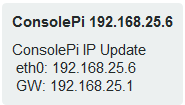
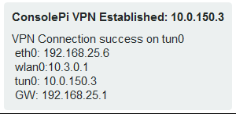

# ConsolePi

Automated Raspberry Pi Serial Console Server, with PushBullet Notification of IP changes, Automatic VPN termination...

*TL;DR:*
Single Command Install Script
`sudo wget -q https://raw.githubusercontent.com/Pack3tL0ss/ConsolePi/master/installer/install.sh -O /tmp/ConsolePi && sudo bash /tmp/ConsolePi && sudo rm -f /tmp/ConsolePi`

------
# Contents
 - [What Does it Do](#what-does-it-do)
 - [Installation](#installation)
 - [Tested Hardware](#tested-hardware)
 - [Credits](#credits)
------

## What Does it Do

Acts as a serial Console Server, allowing you to remotely connect to ConsolePi via Telnet to gain Console Access to devices connected to ConsolePi via USB to serial adapters (i.e. Switches, Routers, etc.)

**AutoHotSpot**

Script runs at boot (can be made to check on interval via Cron if desired).  Looks for pre-defined SSIDs, if those SSIDs are not available then it automatically goes into hotspot mode and broadcasts its own SSID.

When ConsolePi enters hotspot mode, it first determines if the wired port is up and has an IP.  If the wired port is *not* connected, then the hotspot distributes DHCP, but does not provide a "Default Gateway" to clients.  This allows a user to dual connect (using a 2nd NIC on Laptop) without having to remove a route to a gateway that can't get anywhere.

If ConsolePi determines there is a wired connection when the hotspot is enabled it acts as an AP routing (NAT) traffic from clients connected to the hotspot to the wired interface.

**Automatic OpenVPN Tunnel**

When ConsolePi receives an IP via DHCP on any interface it will first verify it's not on the users home network.  If not it will automatically establish a connection to an OpenVPN server based on configuration. 

 **Automatic PushBullet Notification:**  

*(Requires a PushBullet Account, API key, and the app for mobile devices.)*

When ConsolePi receives a dynamic IP address.  A message is sent to your phone via PushBullet API with the IP so you can connect remotely.



When the Automatic VPN function successfully terminates the configured tunnel, the Tunnel IP is sent via PushBullet API



Each Time a Notification is triggered all interface IPs are sent in the message along with the ConsolePi's default gateway

## Installation

**Automatic Installation**

This assumes you have raspbian installed.
Once Configured and connected to the network run this command for automated install

```
sudo wget -q https://raw.githubusercontent.com/Pack3tL0ss/ConsolePi/master/installer/install.sh -O /tmp/ConsolePi && sudo bash /tmp/ConsolePi && sudo rm -f /tmp/ConsolePi
```
The install script is designed to be essentially turn-key.  It will prompt to change hostname, set timezone, and update the pi users password if you're logged in as pi.

**Semi-Automatic Install**

Alternatively you can clone this repository, then run the install script.  The only real benefit here would be pre-configuring some of the parameters in the config file:

```
cd /etc
sudo git clone https://github.com/Pack3tL0ss/ConsolePi.git
```

Optionally Pre-Configure parameters, it will result in less time on data-collection/user-input during the install.

```
sudo nano /etc/ConsolePi.conf
```

Configure parameters to your liking then
ctrl + o  --> to save
ctrl + x  --> to exit
Then run the installer

```cd /etc/ConsolePi
cd /etc/ConsolePi/installer
sudo ./install.sh
```

#**Automated Flash Card Imaging with AutoInstall on boot**

*This is a script I used during testing to expedite the process Use at your own risk it does flash a drive so it could do harm*
Using a Linux System (Ubuntu/Debian variant... tested on Raspbian and Mint) enter the following command:
`curl -JLO https://raw.githubusercontent.com/Pack3tL0ss/ConsolePi/master/installer/ConsolePi_image_creator.sh  && sudo chmod +x ConsolePi_image_creator.sh`

That will download the image creator.
Then I would suggest `head -40 ConsolePi_image_creator.sh`, Which will print the top of the file where everything is explained in more detail.

The short of it is, this can:
- automatically pull the most recent raspbian image if one doesn't exist in the script-dir (whatever dir you run it from)
- Make an attempt to determine the correct drive to be flashed, allow user to verify/confirm (given option to display fdisk -l output)
- Flash image to micro-sd card
- PreConfigure ConsolePi with parameters normally entered during the initial install.  So you bypass data entry and just get a verification screen.
- PreConfigure a WLAN for the ConsolePi to connect to & enable SSH.  Useful for headless installation, you just need to determine what IP address ConsolePi gets from DHCP.
- Use real ovpn installation.  The installer puts an example in, but as the config is specific to your ovpn server, the installer doesn't put a working config in.
- Configure to Auto-Install on first boot.  Only useful if you have a monitor, change the parameter to false if doing headless, as you'd want to do that after you ssh into ConsolePi.  If you don't do Auto-Install this script does create a quick command 'consolepi-install' to simplify the long command string to pull the installer from this repo and launch.

Once Complete you place the newley blessed micro-sd in your raspberryPi and boot.  The installer will automatically do it's thing.

**Manual Installation**

For the brave or curious... Instructions on how to manually install can be found [here](readme_content/ConsolePi - Manual Installation.md).

## Tested Hardware

ConsolePi has been tested on the following:
- RaspberryPi 3 Model B+
  - Tested with RaspberryPi Power supply, PoE Hat, and booster-pack (battery), all worked fine *other than the known over-current errors on the original PoE Hat - still wored on my PoE switch*
- RaspberryPi zero w
  - With both single port micro-usb otg USB adapter and multi-port otg usb-hub
  *I did notice with some serial adapters the RaspberryPi zero w Would reboot when it was plugged in, this is with a RaspberryPi power-supply.  They work fine, it just caused it to reboot when initially plugged-in*

## CREDITS

ConsolePi at it's core utilizes a number of other projects so Some Credit

1. **AutoHotSpotN** ([roboberry](http://www.raspberryconnect.com/network/itemlist/user/269-graeme))

   Network Wifi & Hotspot with Internet
   A script to switch between a wifi network and an Internet routed Hotspot
   A Raspberry Pi with a network port required for Internet in hotspot mode.
   Works at startup or with a seperate timer or manually without a reboot
   Other setup required find out more at
   http://www.raspberryconnect.com

   *ConsolePi Provides the source script for AutoHotSpotN as there are minor modifications to the script for some ConsolePi functionality*

2. **ser2net** ([cminyard](http://sourceforge.net/users/cminyard))

   This project provides a proxy that allows telnet/tcp connections to be made to serial ports on a machine.

   https://sourceforge.net/projects/ser2net/

   https://github.com/cminyard/ser2net

   *The ser2net available from apt works and has been tested, the installation script pulls the far more current version from source and compiles/installs it and builds the config*

3. -- Not Currently Packaged -- **RaspAp** ([billz](https://github.com/billz))

   A simple, responsive web interface to control wifi and hostapd on the Raspberry Pi

   https://github.com/billz/raspap-webgui

   *RaspAP was tested initially with my first ConsolePi, but is not currently built into the ConsolePi Project.  Some of the changes RaspAP makes possible via the web-interface would likely be in conflict with some of the automated scripts.  It's possible but not high priority that it be integrated (as an option) into ConsolePi.*

