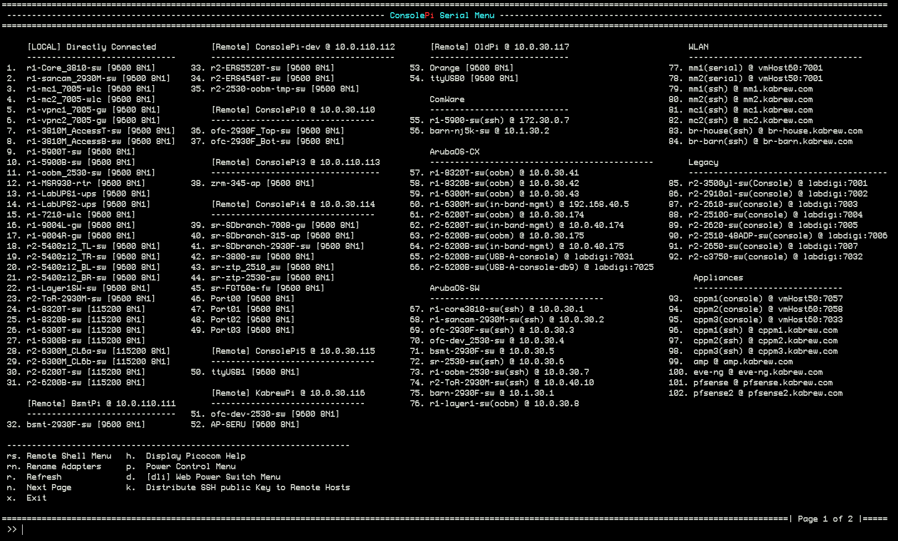
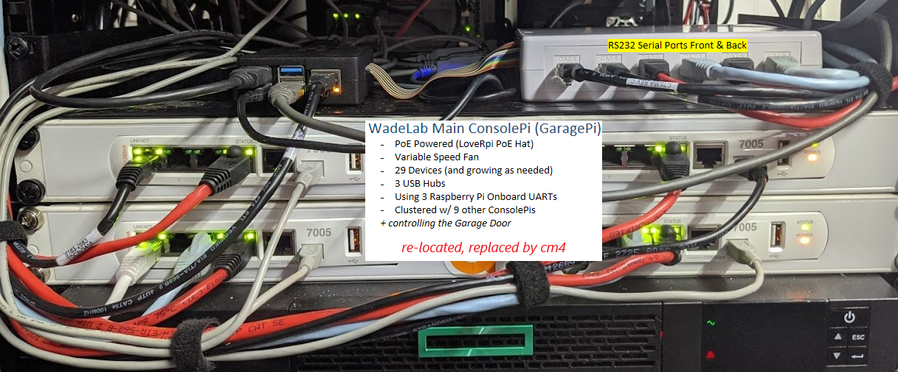

# ConsolePi

Acts as a serial Console Server, allowing you to remotely connect to ConsolePi via Telnet/SSH/bluetooth to gain Console Access to devices connected to local **or remote** ConsolePis via USB to serial adapters (i.e. Switches, Routers, Access Points... anything with a serial port).

*Check out the [ConsolePi Clustering Feature](#consolepi-cluster--cloud-sync)!!*

***TL;DR:***
Single Command Install Script. Run from a RaspberryPi running raspbian (that has internet access):

```
sudo wget -q https://raw.githubusercontent.com/Pack3tL0ss/ConsolePi/master/installer/install.sh -O /tmp/ConsolePi && sudo bash /tmp/ConsolePi && sudo rm -f /tmp/ConsolePi
```
------
# Contents
 - [What's New](#whats-new)
 - [Features](#features)
     - [Serial Console Server](#serial-console-server)
     - [AutoHotSpot](#autoHotSpot)
     - [Automatic VPN](#automatic-openvpn-tunnel)
     - [Automatic PushBullet Notifications](#automatic-pushbullet-notification)
     - [Clustering / Cloud Sync](#consolepi-cluster--cloud-sync)
         - [Supported Cluster Methods](#supported-cluster-sync-methods)
             - [Google Drive](#google-drive)
             - [mDNS / API](#mdns--api)
             - [Manual](#local-cloud-cache)
          - [Important Notes](#important-notes)
      - [API](#api)
      - [Power Control](#power-control)
          - [Power Control Setup](#power-control-setup)
              - [GPIO Connected Relays](#gpio-connected-relays)
              - [espHome flashed WiFi Smart Outlets](#esphome-flashed-wifi-smart-outlets)
              - [Tasmota flashed WiFi Smart Outlets](#tasmota-flashed-wifi-smart-outlets)
              - [DLI Web/Ethernet Power Switch](#dli-webethernet-power-switch)
      - [Manual Host Entries](#manual-host-entries)
      - [ConsolePi Extras](#consolepi-extras)
 - [Installation](#installation)
     - [Automated Installation](#1-automated-installation)
     - [Semi-Automatic Install](#2-semi-automatic-install)
     - [Automated Flash Card Imaging/prep](#3-automated-flash-card-imaging-with-auto-install-on-boot)
     - [Alternative Hardware Installs](#alternative-hardware-installs)
 - [ConsolePi Usage](#consolepi-usage)
     - [Configuration](#configuration)
       - [menu sorting and connection settings](#consolepi-menu-sorting-and-connection-settings)
       - [Local UART support (GPIO)](#local-uart-support)
       - [OVERRIDES](#overrides)
     - [Console Server](#console-server)
         - [TELNET](#telnet)
         - [SSH / BlueTooth (`consolepi-menu`)](#ssh--bluetooth)
      - [Convenience Commands](#convenience-commands)
      - [Upgrading ConsolePi](#upgrading-consolepi)
          - [Custom overrides](#custom-overrides)
 - [Tested Hardware/Software](#tested-hardware--software)
 - [ConsolePi @ Work! (Image Gallery)](#consolepi-@-work)
 - [Credits](#credits)
------

## *!!!You Now Need Buster, buster!!!*
Python 3.6 or greater is *now* required for the menu, mdns, and api to work properly.  This simply means if you have a ConsolePi running Raspbian prior to Buster you should build a new one using the Buster image.  The upgrade script will abort if it finds Python ver < 3.6.  Also note if you manually pull via git, it'll probably break.
> TIP: I use the [ConsolePi_image_creator.sh](#3-automated-flash-card-imaging-with-auto-install-on-boot) script in the installer directory to repeatedly stage and test.  You can use the existing ConsolePi to build it's own upgrade image and stage your existing settings.  This way you'll have the existing sd-card in case you forget to move something.

# What's New

Prior Changes can be found in the - [ChangeLog](changelog.md)

### APR 2020.2.1 minor release
- Most Significant Change is addition of support for espHome flashed outlets
- Added Support for local UARTs.  The Pi4 actually has 6 UARTs (5 are useable), ConsolePi now supports those onboard UARTS (they will show in the menu).  See the [Local UART support (GPIO)](#local-uart-support) section for details.
- Fixed minor issue with keyboard update to US when regulatory domain for hotspot for WLAN is set to US, issue was if user opted to not enable AutoHotSpot (a new option in last release), reg domain wasn't used but was defaulted to US.
- Fixed Show/Hide Linked devices toggle in Power Menu for dli and espHome.  Now correctly displays just what is linked to that specific port (was showing all linked to any port on that dli/espHome device).  Also fixed display of locally defined hosts (TELNET/SSH hosts defined in ConsolePi.yaml), so they appear if linked as well.
- Enhanced the Show/Hide Linked devices toggle to show any adapters defined, vs. previously only showing if the adapter was actually connected. If your terminal client is configured to honor ASCII coloring linked adapters that are disconnected will appear in red (Only applies to adapters, connevtivity is not verified for TELNET/SSH hosts configured in ConsolePi.yaml).
- Fixed issue with rename function for adapters that don't present a serial #

### May 2020 v2020.2.2 minor release
  - The feature was fixed for many use-cases in v2020.2.1, but I discovered issues in some scenarios when a hub was used.  That logic was improved so mapping "lame" adapters to a specific port should now work consistently regardless of the use of hub(s).

### May 2020 v2020.2.3 minor release
  - Fix consolepi-details in some scnearios relaating to existence of outlets in config.
  - Fix configuration parsing of yaml for bools, and related nooff setting for outlets
  - Minor Formatting improvements to consolepi-showaliases

# Features
## **Feature Summary Image**


## **Serial Console Server**
This is the core feature of ConsolePi.  Connect USB to serial adapters to ConsolePi (or use the onboard UART(s)), then access the devices on those adapters via the ConsolePi.  Supports TELNET directly to the adapter, or connect to ConsolePi via SSH or BlueTooth and select the adapter from the menu.  A menu is launched automatically when connecting via BlueTooth, use `consolepi-menu` to launch the menu from an SSH connection.  The menu will show connection options for any locally connected adapters, as well as connections to any remote ConsolePis discovered via Cluster/sync.

For guidance on USB to serial adapters check out the sh#t list [here](adapters.md)

> There are some lame adapters that don't burn a serial # to the chip, this makes assigning a unique name/TELNET port more challenging).  The link above is a page where we note what chipsets are solid and which ones are a PITA.

## **AutoHotSpot**

Script runs at boot (can be made to check on interval via Cron if desired).  Looks for pre-defined SSIDs, if those SSIDs are not available then it automatically goes into hotspot mode and broadcasts its own SSID.  In HotSpot mode user traffic is NAT'd to the wired interface if the wired interface is up.

When ConsolePi enters hotspot mode, it first determines if the wired port is up and has an IP.  If the wired port is *not* connected, then the hotspot distributes DHCP, but does not provide a "Default Gateway" to clients.  This allows a user to dual connect without having to remove a route to a gateway that can't get anywhere.  I commonly use a second USB WLAN adapter to connect to ConsolePi, while remaining connected to the internet via a different SSID on my primary adapter.

> If a domain is provided to the wired port via DHCP, and the hotspot is enabled ConsolePi will distribute that same domain via DHCP to clients.

## Automatic OpenVPN Tunnel

When an interface receives an IP address ConsolePi will Automatically connect to an OpenVPN server under the following conditions:
- It's configured to use the OpenVPN feature, and the ConsolePi.ovpn file exists (an example is provided during install)
- ConsolePi is not on the users home network (determined by the 'domain' handed out by DHCP)
- The internet is reachable.  (Checked by pinging a configurable common internet reachable destination)

##  **Automatic PushBullet Notification**

*(Requires a PushBullet Account, API key, and the app / browser extension.)*

When ConsolePi receives a dynamic IP address.  A message is sent via PushBullet API with the IP so you know how to reach ConsolePi.


An additional message is sent once a tunnel is established if the Automatic OpenVPN feature is enabled.


Each Time a Notification is triggered **all** interface IPs are sent in the message along with the ConsolePi's default gateway(s).

## ConsolePi Cluster / Cloud Sync

The Cluster feature allows you to have multiple ConsolePis connected to the network, or to each other (i.e. first ConsolePi in hotspot mode, the others connected as clients to that hotspot).  A connection to any one of the ConsolePis in the Cluster will provide options to connect to any local serial adapters, as well as those connected to the other ConsolePis in the cluster (via the `consolepi-menu` command).


**Another look at the menu**




### Supported Cluster Sync Methods:

#### Google Drive:
   > Read The [Google Drive Setup](readme_content/gdrive.md) for instructions on setting up Google Drive and authorizing ConsolePi to leverage the API.
 - Google Drive/Google Sheets is currently the only external method supported.  Given this gets the job done, it unlikely more external methods will be added.

 - The ConsolePi will automatically exchange information with `ConsolePi.csv` in your gdrive under the following scenarios (*all assume the function is enabled in the config*):
  1. When the ConsolePi receives an IP address, and can reach the google API endpoints.

  2. When consolepi-menu is launched and the `'r'` (refresh) option is selected.

  3. When a USB to Serial adapter is added or removed.  (This happens on a 30 second delay, so if multiple add/removes are made in a 30 second window, only 1 update to the cloud will occur, that update will include everything that happened within the 30 second window)

  >In all of the above a local cloud cache which includes data for any remote ConsolePis pulled from ConsolePi.csv is updated for the sake of persistence and speed.  The local cloud cache is what is referenced when the menu is initially launched

#### mDNS / API
* ConsolePis now advertise themselves on the local network via mDNS (bonjour, avahi, ...)

* 3 daemons run on ConsolePi one that advertises details via mdns and updates anytime a change in available USB-serial adapters is detected, a browser service which browses for remote ConsolePis registered on the network, and the API described below.  The browser service updates the local cloud cache when a new ConsolePi is detected.

> The API described [here](#api) comes into play when enough adapters are plugged in, such that the data payload would be over what's allowed via mDNS.  In the event this occurs... well here is an example:  ConsolePi-A has a has enough USB to Serial adapters plugged in to be over the data limit allowed via mDNS, the mdns-register service will detect this and fall-back to advertising ConsolePi-A without the adapter data.  ConsolePi-B, and ConsolePi-C are on the network and discover ConsolePi-A.  B and Cs browser service will detect that the adapter data was stripped and request the adapter data from A via the API.  *UPDATE* this happens in the background so I've left it as is, however on menu-load any remotes in the cache are verified to ensure reachability on the network.  This verification is now done via the API, so it's validating it's on the network, and ensuring the data is the most current available from the remote.

#### Local Cloud Cache
  - local cloud cache:  For both of the above methods, a local file `/etc/ConsolePi/cloud.json` is updated with details for remote ConsolePis.  This cache file can be modified or created manually.  If the file exists, the remote ConsolePis contained within are checked for reachability and added to the menu on launch.


###  Important Notes:

 - The Gdrive function uses the hostname as a unique identifier.  If all of your ConsolePis have the same hostname they will each overwrite the data.  The Hostname is also used to identify the device in the menu.


   **Make Hostnames unique for each ConsolePi**

 - The rename option in `consolepi-menu` or the `consolepi-addconsole` command supports assingment of custom aliases used to predictably identify the serial adapters with friendly names (udev rules).  If configured these names are used in `consolepi-menu`, the default device name is used if not (i.e. ttyUSB0), but that's less predictable.

 - `consolepi-menu` does not attempt to connect to the cloud on launch, it retrieves remote data from the local cache file only, verifies the devices are reachable, and if so adds them to the menu.  To trigger a cloud update use the refresh option.
 >Note: that ConsolePi will automatically update the local cache file when it gets an IP address, or adapters are added/removed, so the refresh should only be necessary if other ConsolePis have come online since the the menu was launched.  Additionally ConsolePis will automatically discover each other via mdns if on the same network, this will automatically update the local-cache if a new remote ConsolePi is discovered.

 - Read The [Google Drive Setup](readme_content/gdrive.md) for instructions on setting up Google Drive and authorizing ConsolePi to leverage the API.

   #### If you are configuring multiple ConsolePis to use this cluster, you should consider using the [Flash-Card imaging script](#3.-automated-flash-card-imaging-with-auto-install-on-boot).  Once You've installed the first ConsolePi, leverage the Automated flash-card imaging script to pre-stage the micro-sd cards for the other ConsolePis you will be creating.  This script is handy, if duplicating the install across multiple ConsolePis.  It can pre-stage the entire configuration and cut out some install time.

## ConsolePi API

ConsolePi includes an API with the following available methods (All Are GET methods via http port 5000 currently).

/api/v1.0/
* adapters: returns list of local adapters
* remotes: returns the local cloud cache
* interfaces: returns interface / IP details
* details: full json representing all local details for the ConsolePi

The swagger interface is @ /api/docs or /api/redoc.  You can browse/try the less common API methods there.

The API is used by ConsolePi to verify reachability and ensure adapter data is current on menu-load.

> The API is currently unsecured, it uses http, and Auth is not implemented *yet*.  It currently only supports GET requests and doesn't provide any sensitive (credential) data.  If anyone wants to contribute and/or has ideas on the best way to do this submit an issue or PR.

## Power Control

The Power Control Function allows you to control power to external outlets.  ConsolePi supports:
  - [digital Loggers](https://www.digital-loggers.com/index.html) Ethernet Power Switch/Web Power Switch (including older models lacking rest API).
  - External relays controlled by ConsolePi GPIO ( Like this one [Digital-Loggers IoT Relay](https://dlidirect.com/products/iot-power-relay) ).
  - [espHome](https://esphome.io) flashed WiFi smart outlets (i.e. SonOff S31).  These are low cost outlets based on ESP8266 microcontrollers.
  - [Tasmota](https://blakadder.github.io/templates/) flashed WiFi smart [outlets](https://blakadder.github.io/templates/) These are also esp8266 based outlets similar to espHome.
      > espHome/Tasmota were chosen because it allows for local control without reliance on a cloud service.  So your 'kit' can include a small relatively portable smart outlet which can be programmed to connect to the ConsolePi hotspot.  Then ConsolePi can control that outlet even if an internet connection is not available.
- If the function is enabled and outlets are defined, an option in `consolepi-menu` will be presented allowing access to a sub-menu where those outlets can be controlled (toggle power on/off, cycle).
- Outlets can be linked to Console Adapter(s) (best if the adapter is pre-defined using `consolepi-addconsole`) or manually defined host connections.  If there is a link defined between the outlet and the adapter, anytime you initiate a connection to the adapter via `consolepi-menu` ConsolePi will ensure the outlet is powered on.  Otherwise if the link is defined you can connect to a device and power it on, simply by initiating the connection from the menu **Only applies when connecting via `consolepi-menu`**.
    > The power sub-menu **currently** only appears in the menu on the ConsolePi where the outlets are defined (Menu does not display outlets defined on remote ConsolePis).  The auto-power-on when connecting to an adapter linked to an outlet works for both local and remote connections (establishing a connection to an adapter on a remote ConsolePi (clustering / cloud-sync function) via another ConsolePis menu)

### Power Control Setup

After enabling via `consolepi-upgrade` or during initial install; The `POWER:` section of `ConsolePi.yaml` needs to be populated, see `ConsolePi.yaml.example` for formatting.
The POWER: section of ConsolePi.yaml should look something like this:
```
POWER:
  cloud_lab:
    address: 10.0.230.10
    type: tasmota
  gpio_outlet1:
    address: 4
    linked_devs: ofc-2930F-sw
    type: GPIO
  outlet1:
    address: outlet1.kabrew.com
    type: esphome
    relays: outlet1
    linked_devs:
      Orange6: outlet1
  powerstrip1:
    address: powerstrip1.kabrew.com
    type: esphome
    relays: [relay1, relay2, relay3, relay4]
    linked_devs:
      AP-SERU: relay1
      r2-6200f-sw: [relay3, relay4]
  labpower1:
    type: dli
    address: labpower1.example.com
    username: admin
    password: "C0nS0L3P!TisTheShit"
    linked_devs:
      Lr1-5900T-sw(Console): [1, 6]
      Lr1-5900B-sw(Console): [1, 6]
      Lr1-5900T-sw(ssh): 6
      Lr1-5900B-sw(ssh): 6
      Lr1-8320T-sw(oobm): [1, 2]
      Lr1-8320B-sw(oobm): [1, 2]
      Lr1-8320T-sw(Console): [1, 2]
      Lr1-8320B-sw(Console): [1, 2]
      Lr1-6300M-sw(oobm): 8
      Lr1-6300M-sw(in-band-mgmt): 8
      6300T: 8
      6300B: 8
  labpower2:
    type: dli
    address: labpower2.example.com
    username: admin
    password: "fakepass"
```
The example above assumes you have adapters (aliases) or have host deffinitions for the linked_devs ('ofc-2930F-sw' ...).  For the adapter aliases You can use `consolepi-addconsole` or the `rn` (rename) option in `consolepi-menu` to create the aliases.

> You could link the root devices i.e. ttyUSB0 or ttyACM0 to an outlet.  This will work if there is no alias configured for the adapter.  The predictable aliases just ensure the outlet is linked to a specific physical adapter, where the root devices essentially links the outlet to whichever adapter was plugged in first.  In either case the function only powers ON the outlet automatically.  It will **not** power OFF a device. The power sub-menu provides full on|off|cycle capabilities for the ports.


explanation of keys:
```
POWER: <-- required section header
  unique_name_for_outlet_grp: [required] ... this is how the outlet is described in the power sub-menu
    type: [required, valid values = GPIO, tasmota, dli]
    address: [required, GPIO pin (BCM numbering) if type is "GPIO" OR ip address/fqdn if type is "tasmota" or "dli"]
    noff: [optional (bool) applies to GPIO default is true] ... indicates if outlet is normally off (true) or normally on (false)
    relays: [required and only applies to espHome outlets] ... This is the `name` of the relay being controlled (see espHome section below)
    username: [required for dli] username used to access the dli
    password: [required for dli] password used to access the dli - use quotes if special characters such as `:` are in the password.
    linked_devs: [optional] adapter or host that is linked or a list of adapters hostnames if multiple linked to same outlet
                            for dli the format is: linked-dev-name: port (or [port, port, port] for linking single device to multiple ports)
```
> You can link a single dev to multiple outlets/outlet-types, you can also link the same outlet to multiple devices/hosts.

#### GPIO Connected Relays
- For GPIO controlled relays: The trigger on the relay should be connected to GPIO ports.  Trigger(+) to one of the GPIO pins, Trigger(-) to one of the GPIO ground pins.
- ConsolePi expects the GPIO number not the Board pin # in the `POWER:` secion of `ConsolePi.yaml`.  For example given the GPIO layout for the Raspberry Pi below.  Board Pin # 7 = GPIO 4.  `ConsolePi.yaml` should be populated with 4.
> The Power Control Function supports relays with outlets that are 'normally on' or 'normally off'.  A 'normally off' outlet will not apply power until told to do so by ConsolePi (voltage applied to Trigger).  A 'normally on' outlet works the opposite way, it will have power with no voltage on the trigger, meaning it would be powered even if there is no connection to the ConsolePi.  It only powers off the outlet if ConsolePi applies voltage.
>
> *A 'normally off' outlet will revert to powered off if ConsolePi is powered-off, disconnected, or rebooted, inversly a 'normally on' outlet will revert to a powered-on state if ConsolePi is powered-off, disconnected, or rebooted.*  The default is 'normally off', use `noff: false` for 'normally on' outlets.


#### espHome Flashed WiFi Smart Outlets
- You'll need a WiFi smart outlet running espHome.  There are plenty of resources online to help with that.
- The one requirement from an espHome standpoint is to enable the local web-server via
```
# Enable Local Web Server  ## THIS IS NOT FOR ConsolePi.yaml, it's for espHome config used to build Binary ##
web_server:
  port: 80
```
*This is done in the yaml file used to compile the binary for flashing the espHome device*

- You can control the outlet as long as ConsolePi can reach it (IP).
- When setting the outlet to connect to ConsolePi via hotspot, it's best to configure a DHCP reservation so it is assigned the same IP everytime.  This way the IP in ConsolePi.yaml is always valid.

To add a DHCP reservation you'll need to determine the MAC address of the smart-outlet.  If you're not sure what the MAC is, you can run `tail -f /var/log/syslog | grep DHCPACK`.  Then power on the smart-outlet.  Once it connects and gets DHCP you should see a log with the MAC.  Then use <ctrl+c> to break out of `tail -f`.
To Create the reservation add a file in either `/etc/ConsolePi/dnsmasq.d/autohotspot/` (`/etc/dnsmasq.d/` if your ConsolePi was deployed before the change to a ConsolePi specific dnsmasq instance) directory called something like `smartoutlets`
```
sudo nano /etc/ConsolePi/dnsmasq.d/autohotspot/smartoutlets
```
Then in nano add something like the following:
```
#Outlet A
dhcp-host=b4:e6:2d:aa:bb:99,outleta,10.3.0.11
```
repeat as needed for multiple outlets.

Then the `POWER:` section of your `ConsolePi.yaml` would include something like this:
```
POWER:
  outlet1:
    address: outlet1.example.com
    type: esphome
    relays: outlet1
    linked_devs:
      Orange6: outlet1
  powerstrip1:
    address: 10.0.10.123
    type: esphome
    relays: [relay1, relay2, relay3, relay4]
    linked_devs:
      AP-SERU: relay1
      Orange6: [relay2, relay3]
```
The example above highlights a couple of scenarios.  A multi-port power-strip, and a single port device.  With espHome there is a "relays:" key in the config where the relays are defined.  The values should match what was configured in the yaml used to compile the binary flashed to the device, for example this is a snippet from the config used to build the binary for powerstrip1 above:
```
### THIS IS NOT AN EXAMPLE FOR ConsolePi.yaml, This is an example for espHome, more details found on espHome's site
switch:
  - platform: gpio
    name: "Relay1"
    id: relay1
    icon: "mdi:power-socket-us"
    pin:
      number: GPIO13
  - platform: gpio
    name: "Relay2"
    id: relay2
    icon: "mdi:power-socket-us"
    pin:
      number: GPIO12
```
Notice the `id` of the relay that controls the outlet is what is configured as `relays:` in ConsolePi.yaml.  Beyond that similar to other outlet types you can link a device with a single outlet/relay or multiple.  You can also specify the same device across multiple controlled outlets/power-strips.  "Orange6" above will lead to outlet1 as well as relay2 and 3 on powerstrip1 all being toggled ON when connecting to Orange6 via the menu.


#### Tasmota Flashed WiFi Smart Outlets
> Note: I only tested Tasmota with single outlet devices, never with a multi-relay device like a power strip.  So support for Tasmota at the moment is for single port devices.  espHome which should be supported on the same devices Tasmota is supported on does have support for power-strips.
- You'll need a WiFi smart outlet running Tasmota.  There are plenty of resources online to help with that.  You should start [here](https://blakadder.github.io/templates/)
- You can control the outlet as long as ConsolePi can reach it (IP).
- When setting the outlet to connect to ConsolePi via hotspot, it's best to configure a DHCP reservation so it is assigned the same IP everytime.  This way the IP in ConsolePi.yaml is always valid.  *some instructions on how that is done can be found above in the espHome section*


Then the `POWER:` section of your `ConsolePi.yaml` would include something like this:
```
POWER:
  OutletA:
    type: tasmota
    address: 10.3.0.11
    linked_devs: [Aruba2930F_cloud-lab, SDBranchGW1_cloud-lab]
```

#### DLI Web/Ethernet Power Switch

Just add the definition for the dli in power.json which should look something like this:
```
POWER:
  labpower1:
    type: dli
    address: labpower1.example.com
    username: apiuser
    password: redacted
    linked_devs:
      2530IAP: [5, 6]
  labpower2:
    type: dli
    address: labpower2.example.com
    username: apiuser
    password: redacted
    linked_devs:
      2530IAP: 8
      Aruba6300: 8
  dli_with_no_linked_outlets:
    type: dli
    address: 10.0.30.71
    username: apiuser
    password: redacted
```
**The Above Example highlights different options**
- Outlet Group "labpower1" has multiple ports linked to a single adapter.  Both ports would be powered on when connecting to that adapter.
- Outlet Group "labpower2" has a single port linked to multiple adapters.  Connecting to either adapter via the menu will result in the port being powered
- The /dev/ prefix is optional.
- This function will work for adapters or manually defined hosts (see below)
- The last Outlet Group defines the dli, but has no linkages.  This outlet group won't appear in the power menu invoked by 'p', but dlis have thier own dedicated menu 'd' that displays all ports on the dli.
- Notice `2530IAP` is linked in 2 different outlet groups, meaning a connection to 2530IAP will power on labpower1 port 5 and 6, as well as, labpower2 port 8.


### Manual Host Entries
The Manual Host Entries Feature allows you to manually define other SSH or TELNET endpoints that you want to appear in the menu.  These entries will appear in the `rs` remote shell menu by default, but can also show-up in the main menu if `show_in_main: true`.  Manual host entries support outlet linkages (Auto Power On when connecting through the menu) To enable this feature simply populate the optional `HOSTS:` section of `ConsolePi.yaml`. Using the following structure:

```
HOSTS:
  mm1(serial):
    address: 10.0.30.60:7001
    method: telnet
    show_in_main: true
    group: WLAN
  mc1(ssh):
    address: 10.0.30.24
    method: ssh
    username: wade
    show_in_main: true
    group: WLAN
  LabDigi1:
    address: labdigi.kabrew.com
    method: ssh
    username: wade
  omv:
    address: omv.kabrew.com
    method: ssh
    username: root
    group: WADELAB-HOSTS
```
**The Above Example highlights different options**
- The address field can be a IP or FQDN and a custom port can be included by appending :port to the end of the address if no port is defined the standard port for the protocol specified via the `method` key is used (22 for ssh 23 for TELNET).
- mm1 shows the address with an optional non-std port defined.  Connection would be made via TELNET on port 7001
- mm1 and mc1 will show up in the main menu both grouped under the WLAN sub-head
- LagDigi1 does not define a group or set show_in_main (both are optional).  It will show up in the rshell menu in group "user-defined".
- omv will show up in the rshell menu under group "WADELAB-HOSTS"
- outlet linkages with these devices are supported by adding the device name in linked_devs for an outlet defined in the POWER: section
    > Ensure names are unique across both hosts defined here and the adapters defined via the menu or `consolepi-addconsole`.  If there is a conflict the serial adapter wins.

### consolepi-extras
Toward the end of the install, and via `consolepi-extras` anytime after the install, you are provided with options to automate the deployment (and removal for most) of some additional tools.  This is a selection of tools not required for ConsolePi, but often desired, or useful for the kind of folks that would be reading this/using ConsolePi.


>Note: speed test (locally hosted browser based speed-test), is only presented as an option for Pi4.

# Installation

If you have a Linux system available you can use the [Flash-Card imaging script](#3.-automated-flash-card-imaging-with-auto-install-on-boot)  to burn the image to a micro-sd, enable SSH, pre-configure a WLAN (optional), and PreConfigure ConsolePi settings (optional).  This script is especially useful for doing headless installations.

**The Following Applies to All Automated Installation methods**
> Note Previous versions of ConsolePi supported import from either the users home-dir or from a `ConsolePi_stage` subdir in the users home-dir (i.e. `/home/pi/ConsolePi-stage`).  The import logic directly from the home-dir has not been removed, but going forward any new imports will only be tested using the `ConsolePi-Stage` directory for simplicity.

ConsolePi will **optionally** use pre-configured settings for the following if they are placed in the a `ConsolePi_stage` subdir in the users home folder (i.e. `/home/pi/ConsolePi_stage`).  This is optional, the installer will prompt for the information if not pre-configured.  It will prompt you to verify either way.  *Imports only occur during initial install not upgrades.*

- ConsolePi.yaml: This is the main configuration file where all configurable settings are defined.  If provided in the `ConsolePi_stage` dir the installer will ask for verification then create the working config `/etc/ConsolePi/ConsolePi.yaml`

- ConsolePi.ovpn: If using the automatic OpenVPN feature this file is placed in the appropriate directory during the install. *Note: there are a few lines specific to ConsolePi functionality that should be at the end of the file, The installer will verify and add those lines if they don't exist*

- ovpn_credentials: Credentials file for OpenVPN.  Will be placed in the appropriate OpenVPN dir during the install.  This is a simple text file with the openvpn username on the first line and the password on the second line.

  *The script will chmod 600 everything in the /etc/openvpn/client directory for security so the files will only be accessible via sudo (root).*

- 10-ConsolePi.rules: udev rules file used to automatically map specific adapters to specific telnet ports.  So every time you plug in that specific adapter it will be reachable on the same telnet port even if other adapters are also plugged in.  Pre-Configuring this is only useful if you are doing a rebuild or creating additional ConsolePis to work in a cluster and already have a rules file defined.

- wpa_supplicant.conf:  If found during install this file will be copied to /etc/wpa_supplicant.  The file is parsed to determine if any EAP-TLS SSIDs are configured, and if so the associated certificate files are also copied to the directory specified in the wpa_supplicant.conf file.

  certs should be pre-staged in `ConsolePi_stage/cert`
    > WARNING EAP-TLS raspbian buster wpa_supplicant bug:  (*you can disregard if you are using psk, this only applies to certificate based authentication*) The version of wpa_supplicant of an associated dependency that buster *still* installs has a bug that will prevent EAP-TLS from working (wpa_supplicant v2.8-devel).  On my RPi 3 and 4 units I use the `ConsolePi_init.sh` (described below) file to update wpa_supplicant manually like so:
    >
    > sudo apt install -y ./libreadline8_8.0-2_armhf.deb
    >
    > sudo apt install -y ./wpasupplicant_2.9-1_armhf.deb
    >
    > There may be a better way, but this is working on all my Pi3/4s, on my Pi Zero Ws installing these packages breaks wpa_supplicant entirely.  For those I currently just use the psk SSID (which I expect most would do, but good tip anyway for the cool kids using certs)

- ConsolePi_init.sh: Custom post install script.  This custom script is triggered after all install steps are complete.  It runs just before the post-install message is displayed.  Use it to do anything the installer doens't cover that you normally setup on your systems.  For Example my ConsolePi_init.sh script does the following:
  - generates an ssh key `sudu -u $iam ssh-keygen`
  - sends that key to my NAS `sudo -u $iam bash -c "echo 'MyP@ssisFake' | ssh-copy-id git@omv 2>/dev/null"`
  - Then it pulls a few files common to all my systems makes executable if it applies etc
    - `sftp git@omv:/export/BACKUP/Linux/common/wlmount` ... then make executable etc...
  - I pull cloud credentials for ConsolePi from my main ConsolePi system.
  - modify /etc/nanorc to my liking
  - Update wpa_supplicant if the bug version is installed (unless it's a pi Zero W)

  This is just an optional mechanism to automatically prep whatever it is you normally prep on your systems after the install complets.

  > Some functions variables available to the script (will be in the environment) that you could leverage:
  > - $iam (variable) is the user (script is ran as root hence the sudo -u examples above to run a command as the user that launched the installer)
  > - $logit (function) logit "message to log" ["log-level" defaults to "INFO"] *log-lvl "ERROR" results in script aborting if it hits*

**To enable the Clustering / Cloud-Sync function see the description [above](#consolepi-cluster-/-cloud-config) and the prerequisite [Google Drive Setup](readme_content/gdrive.md)  instructions.**

## **1. Automated Installation**

Install raspbian on a raspberryPi and connect it to the network.

Use the command string below to kick-off the automated installer.  The install script is designed to be essentially turn-key.  It will prompt to change hostname, set timezone, and update the pi users password if you're logged in as pi.  Be sure to checkout the [image creator script](#3-automated-flash-card-imaging-with-auto-install-on-boot) if doing a headless install, or if you are creating multiple ConsolePis

```
sudo wget -q https://raw.githubusercontent.com/Pack3tL0ss/ConsolePi/master/installer/install.sh -O /tmp/ConsolePi && sudo bash /tmp/ConsolePi && sudo rm -f /tmp/ConsolePi
```

## **2. Semi-Automatic Install**

Alternatively you can clone this repository to /etc manually, then run the install script.  The only real benefit here would be pre-configuring some of the parameters in the config file:

```
cd /etc
sudo git clone https://github.com/Pack3tL0ss/ConsolePi.git

- or -

cd /tmp
git clone https://github.com/Pack3tL0ss/ConsolePi.git
sudo mv /tmp/ConsolePi /etc
```

Optionally Pre-Configure parameters, it will result in less time on data-collection/user-input during the install.  Just grab the ConsolePi.yaml.example file from the repo, edit it with your settings, and rename/place in  \<user-home-dir\>/ConsolePi_stage/ConsolePi.yaml

```
# example assuming logged in as pi
cd ~/
mkdir ConsolePi_stage
sudo cp ConsolePi.yaml.example ~/ConsolePi_stage/ConsolePi.yaml
sudo nano ConsolePi.yaml
```

Configure parameters to your liking then
ctrl + o  --> to save
ctrl + x  --> to exit
Then run the installer

```
sudo /etc/ConsolePi/installer/install.sh
```

## 3. Automated Flash Card Imaging with Auto-Install on boot

**Script has been tested and works with USB to micro-sd adapter and sd to micro-sd adapters.**

*This is a script I used during testing to expedite the process Use at your own risk it does flash a drive so it could do harm!*

*NOTE: USB adapters seemed to have more consistency than sd/micro-sd adapters, the latter would occasionally not mount until after the adapter was removed and re-inserted*

Using a Linux System (Most distros should work ... tested on Raspbian and Mint) enter the following command:
- `curl -JLO https://raw.githubusercontent.com/Pack3tL0ss/ConsolePi/master/installer/ConsolePi_image_creator.sh  && sudo chmod +x ConsolePi_image_creator.sh`
- That will download the image creator and make it executable.

-- or --

From an existing ConsolePi just copy the script to your home-dir for convenience and run from there:
- `cp /etc/ConsolePi/installer/ConsolePi_image_creator.sh ~/`
- Then once you have the micro-sd you want to flash in place
- `sudo ./ConsolePi_image_creator.sh`
> If copying don't forget to re-copy after doing upgrades to get any improvements made to the script.

#### **ConsolePi_image_creator brief summary:**

*The "Stage dir" referenced below is a sub directory found in the script dir (the directory you run the script from).  The script looks for the Stage dir which needs to be named 'ConsolePi_stage' and moves the entire directory to the pi users home directory on the media being imaged.*

The Pre-staging described below is optional, this script can be used without any pre-staging files, it will simply burn a Raspbian image to the micro-sd and set the installer to run automatically on boot (unless you set auto_install to false in the script.  It's true by default).

> NOTE: The script will look for and pull down the most current Raspbian "lite" image, to use the desktop of full image change the img_type line in the script (comments within the script explain the options)

**What the script does**
- automatically pull the most recent raspbian image (lite by default) if one is not found in the script-dir (whatever dir you run it from)
  - It will check to see if a more current image is available and prompt for image selection even if an image exists in the script dir.
- Make an attempt to determine the correct drive to be flashed, and display details for confirmation.  User to verify/confirm before writing.
- Flash image to micro-sd card
- PreConfigure ConsolePi with parameters normally entered during the initial install.  So you bypass data entry and just get a verification screen.
- The entire stage dir (ConsolePi_stage) is moved to the micro-sd if found in the script dir.  This can be used to pre-stage a number of config files the installer will detect and use, along with anything else you'd like on the ConsolePi image.
- Pre-Configure a psk or open WLAN via parameters in script, and Enable SSH.  Useful for headless installation, you just need to determine what IP address ConsolePi gets from DHCP if doing a headless install.
- You can also pre-configure WLAN by placing a wpa_supplicant.conf file in the stage dir.  This method supports the typical methods along with EAP-TLS with certificates.  Just place the cert files referenced in the provided wpa_supplicant.conf file in a 'cert' folder inside the stage dir.  ( Only works for a single EAP-TLS SSID or rather a single set of certs ).
- PreStage all OpenVPN related files (ConsolePi.ovpn and ovpn_credentials) by placing them on the ConsolePi image.  The script will detect them if found in the stage dir.  The installer will then detect them and place them in the /etc/openvpn/client directory.  By default the installer places example files in for OpenVPN (as the specifics depend on your server config).
- create a quick command 'consolepi-install' to simplify the command string to pull the installer from this repo and launch.
- The ConsolePi installer will start on first login, as long as the RaspberryPi has internet access.  This can be disabled by setting auto_install to false in this script.

Once Complete you place the newly blessed micro-sd in your raspberryPi and boot.  The installer will automatically start unless you've disabled it.  In which case the `consolepi-install` will launch the installer.

## Alternative Hardware Installs

For my use case I manually installed these, but depending on the system/use-case you could use the installer in the same method described above. *results may vary :)*

The Use Cases
  1. ConsolePi running on a Linux Mint LapTop
      - desire was to be able to load the menu, see the remotes, and use a locally connected adapter if I wanted, but to only sync one way (discover remote ConsolePis, but don't advertise to them).  This is because the laptop is used ad-hoc and if I'm using it I'm on it, not remote.
      - Install Process was simply (this is from memory so might be off a bit):
          1. `cd /tmp`
          2. `git clone https://github.com/Pack3tL0ss/ConsolePi.git`
          3. `cd ConsolePi`
          2. `sudo apt install python3-pip` (if required pip not installed for python3)
          3. `python3 -m pip install virtualenv`
          4. `cd /tmp/ConsolePi`
          5. `python3 -m virtualenv venv`
          6. `sudo mv /tmp/ConsolePi /etc`
          7. `sudo cp /etc/ConsolePi/src/consolepi.sh /etc/profile.d && . /etc/profile.d/consolepi.sh` <-- this script adds the consolepi-commands to PATH
          8. `consolepi-sync -pip`  <-- this updates the permissions on the directory if necessary and installs/updates all the requirements.
          9. `cp /etc/ConsolePi/ConsolePi.yaml.example /etc/ConsolePi/ConsolePi.yaml`
          10. `consolepi-config`  -- edit as necessary for this use case, I used `cloud_pull_only: true` option in the OVERRIDES: section.
          11. `sudo cp /etc/ConsolePi/src/systemd/consolepi-mdnsbrowse.service /etc/systemd/system`
          12. `sudo systemctl enable consolepi-mdnsbrowse`
          13. `sudo systemctl start consolepi-mdnsbrowse`
          14. `consolepi-menu` <-- test the menu (note if cloud sync enabled you still need to put the creds in the dir).
            -  Select option `r` (refresh) if cloud enabled and creds in place.
            > If you've completed [Google Drive Setup](readme_content/gdrive.md), and need to authorize ConsolePi for the first time launch the menu with the `cloud` argument (`consolepi-menu cloud`) (then select the `r` (refresh) option).  This is only required to create the credential files for the first time, you can use `consolepi-menu` without arguments to launch after the creds have been created.

        *I think that's it.  So the above will allow use of the menu on the LapTop, will detect any local adapters if any are plugged in, will discover and allow connection to any remotes, manually defined hosts, power outlets, etc, but will not advertise itself to any other ConsolePis*
  2. ConsolePi running on wsl-ubuntu (Windows Subsystem for Linux)
      - Use Case... I just wanted to see if it would work.  I also have it open a lot so handy to be able to just run from there.
      - Not using local-adapters wsl would be remote only.
      - Install process: Same as above with the exception of leave out the consolpi-mdnsbrowse bit (no systemd on wsl)
      - Result is it works as expected, with the minor caveat that it's only source to get remote details is via cloud-sync.  Adapter data is still refreshed on menu-load by querying the remote directly.  You also can not create the cloud credentials files (do the initial Authorization) in wsl.  That needs to be done on another system and coppied over.

# ConsolePi Usage

## **Configuration:**

The Configuration file is validated and created during the install.  Settings can be modified post-install via the configuration file `/etc/ConsolePi.yaml` (Some Changes will require consolepi-upgrade to be ran to take effect). See ConsolePi.yaml.example for an example of the available options.

### **consolepi-menu sorting and connection settings**
When you assign a friendly alias to an adapter for predictability via the `rn` (rename) option in `consolepi-menu` or via `consolepi-addconsole` an alias (udev rule) is created for that adapter and ser2net.conf is updated with a pointer to that alias using the next available TELNET port in the 7xxx range which includes the desired serial settings.  The `consolepi-menu` parses the ser2net.conf to retrieve the serial settings for each device, but it also uses this file to determine the order the adapters appear in the menu.  The menu is sorted by TELNET port#.  So if you want re-arrange the order devices show up you just need to re-arrange the port #s used in ser2net.conf for the devices.

### **Local UART Support**

With Version 2020.2.1 ConsolePi supports use of the onboard UARTs for external connections.  The Pi4 actually has 6 UARTs onboard (5 useable).  The additional UARTs would need to be enabled.  The examples below should get you there if you want to make use of the extra UARTs, obviously you can search the internet or refer to the Pi4 [datasheet](https://www.raspberrypi.org/documentation/hardware/raspberrypi/bcm2711/rpi_DATA_2711_1p0.pdf) for info beyond that.

>Note: The RaspberryPis onboard UARTs are TTL level.  This is useful for connecting to other devices with TTL level UARTs (i.e. Another Rpi, Arduino, or Aruba APs that used the flat 4 pin connector (The grey Aruba Adapter used to connect to these APs `AP-SER` has a TTL to RS232 level shifter built into the cable)).  To use these to connect to RS232 ports typically found on Network Hardware and other equipment you need a ttl<-->RS232 level shifter i.e. (max232 family).
>
>The example is pulled from my [primary ConsolePi](#consolepi-@-work) which has been customized to the extent that it is powered via PoE hat (LoveRpi Pi4 PoE Hat) and extends GPIO via a modified 30 pin idc cable.  The first 10 pins are not extended, as a result of the PoE hat consuming the first 6.

  **To Enable:**
  ```
  # related snippet from /boot/config.txt

  #Enable Default UART (used to access this ConsolePi not externally)
  enable_uart=1

  # Enable Additional UARTs
  # dtoverlay=uart0,<param>=<val>
  # Params: txd0_pin                GPIO pin for TXD0 (14, 32 or 36 - default 14)
  #         rxd0_pin                GPIO pin for RXD0 (15, 33 or 37 - default 15)
  #         pin_func                Alternative pin function - 4(Alt0) for 14&15,
  #                                 7(Alt3) for 32&33, 6(Alt2) for 36&37

  # Enable uart 2 on GPIOs 0,1
  dtoverlay=uart2

  # Enable uart 3 on GPIOs 4,5
  # Disabled, no access to this UART due to PoE hat (This unit extends GPIO using modified 30 pin IDC cable where GPIO17/pin 11 is first pin extended)
  # dtoverlay=uart3

  # Enable uart 4 on GPIOs 8,9
  dtoverlay=uart4

  # Enable uart 5 on GPIOs 12,13
  dtoverlay=uart5
  ```

  ```
# /boot/cmdline.txt

# The default UART is enabled for "inbound" access to this Pi, the pins are actually not accessible in my setup so they are not used at all
console=serial0,115200 console=tty1 root=PARTUUID=73aabb67-02 rootfstype=ext4 elevator=deadline fsck.repair=yes rootwait

# the remaining UARTS configured for external access, Note that uart3 is not actually being used due to pin access
console=ttyAMA1,115200
console=ttyAMA2,115200
console=ttyAMA3,115200
console=ttyAMA4,115200
```

#### ConsolePi.yaml Configuration to enable local UARTs

ConsolePi.yaml needs to include a TTYAMA: key (where `TTYAMA` is not indented, it should be at the same level as `CONFIG` or the optional `OVERRIDES`, `HOSTS`, and `POWER` keys)

Given the example above with 3 uarts enabled (technically 4 but the default UART is used for "inbound" access)

```
TTYAMA: [ttyAMA1, ttyAMA2, ttyAMA3]
```
The onboard UARTs will then showup in the consolepi-menu as ttyAMA#, you can then use the rename option to assign a friendly name and configure custom serial settings (i.e. change the baud used by the menu, the rename option will also add the device to ser2net using the next available TELNET port in the 7xxx range)

### **OVERRIDES:**

**Optional Overrides to prevent `consolepi-upgrade` from updating ConsolePi related system files**

To Upgrade ConsolePi it's recommended to use the `consolepi-upgrade` command.  This runs the install/upgrade script which on upgrade will verify some of the system configuration related to ConsolePi functionality.  If you've made customizations to any of the system files ConsolePi initially configures, the upgrade script will backup the file (to /etc/ConsolePi/bak) and replace it.  This may be undesired if you've made customizations, to prevent this from occuring simply create an empty file (doesn't technically have to be empty) with the same name as the file you want to prevent being modified by ConsolePi in '/etc/ConsolePi/overrides' (i.e. `touch /etc/ConsolePi/overrides/dhcpcd.conf`)

**List of files ConsolePi will verify and potentially update**
- /etc/dhcpcd.conf
- /etc/network/interfaces
- /etc/default/hostapd
- /etc/hostapd/hostapd.conf
- /etc/profile.d/consolepi.sh  *This file adds the consolepi-commands directory to PATH, but also prints the ConsolePi ascii banner on login, to get rid of the banner, or create a custom banner you could modify the file and place an empty consolepi.sh in overrides dir, you do need the PATH update for any of the `consolepi-...` commands to work.*
- /etc/hosts  *Hostname is added mapped to hotspot IP, needed for proper resolution if client where to connect to the hotspot and try to access by hostname)*


 *On ConsolePis Built prior to v2020.2 (merged in April 2020) the following may also apply (AutoHotSpot now uses it's own dnsmasq service separate from the default)*
- /etc/dnsmasq.conf

**Service Files**

Overriding Service files not only turns off validation of the contents of the systemd unit file, but also the state of the service (enabled/disabled)

- bluetooth.service
- rfcomm.service *You can override rfcomm.service if running ConsolePi on older hardware lacking bluetooth (it'll fail given no hardware is present)*

And for systems built prior to v2020.2:
- dnsmasq.service *Script will ensure the servie is disabled as startup is handled by AutoHotSpot*
- hostapd.service *Script will ensure the servie is disabled as startup is handled by AutoHotSpot*

**Optional override Variables in ConsolePi.yaml**

ConsolePi.yaml also supports a few customizations via the optional `OVERRIDES` section.  Examples of most of them should be in your configuration after the install (with the default values, so they are not overriding anything just in place as a reference).

A summary of available overrides:
- **skip_utils:** Instruct the upgrade script to skip the optional utilities step (this step can be done outside the installer via `consolepi-extras`).
- **default_baud:** This rarely comes into play.  It only applies to a device that is detected, but has no entry in ser2net.conf  Given ser2net.conf is pre-populated with 20 devices for ttyUSB# and ttyACM# both, it's unlikely default_baud would ever apply to a device.  (default_dbits, default_parity, default_flow, default_sbits - are all available as overrides as well)
- **cloud_pull_only:** Primary use case is for Non-rPi where you want to launch the menu and access adapters on remotes (i.e. a laptop).  This only applies if cloud-sync is enabled.  Will result in pulling data from the cloud, but not updating the cloud with the laptops details (so the laptop would never show up in the menu if accessed from one of the other ConsolePis)
- **compact_mode:**  This feature is still a bit of a test use, and will only apply if you have multiple remotes (multiple ConsolePis that discover each other via mdns or cloud sync).  Remotes are typically broken into groupings by remote ConsolePi, `compact_mode: true` will result in all remote adapters appearing in the same group.
- **remote_timeout:**  If remotes have been discovered ConsolePi fetches current adapter details from that remote when the menu is launched to ensure adapter data is current and verify the remote is reachable.  The default timeout is 3 seconds, if the request takes longer it's considered unreachable and doesn't show up in the menu.  This is normally a good balance.  If it's too high verification and menu_load is delayed when remotes are not reachable, however I have seen cases where 3 seconds may be too low.  Typically on very old Raspberry Pis with a lot of adapters connected (i.e. had the issue on original Pi B with ~ 20 adapters).


## **Console Server:**

### TELNET

*Don't overlook consolepi-menu which supports remote ConsolePi discovery and provides a single launch point into any local and remote connections discovered*

- Serial/Console adapters that show up as ttyUSB# devices when plugged in are reachable starting with telnet port 8001 +1 for each subsequent adapter plugged in (8002, 8003...). If you use multiple adapters then it may be a crap shoot which will be assigned to each telnet port (or which root dev (ttyUSB#) they appear as).  Hence the next step.

- Serial/Console adapters that show up as ttyACM# devices start at 9001 +1 for each subsequent device.

> Most USB to serial adapters present as ttyUSB, some embeded adapters; i.e. network devices with built in USB consoles typically show up as ttyACM#

- The install script automates the mapping of specific adapters to specific ports.  The defined predictable adapters start with 7001 +1 for each adapter you define.  The reasoning behind this is so you can label the adapters and always know what port you would reach them on.  Key if you are using a  multi-port pig-tail adapter, or if multiple adapters are plugged in @ boot.  This can also be accomplished after the install via the `consolepi-addconsole` command or via rename (`rn`) option in `consolepi-menu`

  >Note: Some cheap a@# serial console adapters don't define serial #s, which is one of the attributes used to uniquely identify the adapter.  The rename function/`consolepi-addconsole` command now support these adapters, but with caveats explained by the script when such a case is detected.

Note: the 8000/9000 range is always valid even if you are using an adapter specifically mapped to a port in the 7000 range.  So if you plug in an adapter (ttyUSB) pre-mapped to port 7005, and it's the only adapter plugged in, it would also be available on port 8001

- Port monitoring/and control is available on TELNET port 7000.  This allows you to change the baud rate of the port on the fly without changing the config permanently.  The installer configures all ports to 9600 8N1.
- Serial Port configuration options can be modified after the install in /etc/ser2net.conf or via the rename option in the menu (just specify the same name, you are offered the option to change serial settings after specifying the new name)


### SSH / BlueTooth

The ```consolepi-menu``` command can be used to display a menu providing options for any locally connected USB to Serial adapters.  In addition to any remotely connected USB to serial adapters connected to other remote ConsolePis discovered (either via mdns or the Cloud Sync function).  When connecting to ConsolePi via bluetooth this menu launches automatically.
> Note that when using bluetooth the menu is limited to local adapters and remotes found in the local-cache file.  Connect via SSH for full remote functionality in the menu.
>
>Serial Adapter connection options (baud, flow-control, data-bits, parity) are extracted from ser2net.conf by consolepi-menu.  If there is an issue getting the data it falls back to the default of 9600 8N1 which can be changed in the menu (option c)


## **Convenience Commands:**

There are a few convenience commands created for ConsolePi during the automated install

- **consolepi-menu**: Launches ConsolePi Console Menu, which will have menu items described in the list below.  This menu is launched automatically when connecting to ConsolePi via BlueTooth, but can also be invoked from any shell session (i.e. SSH)

    - Connection options for locally attached serial adapters
    - Connection options for serial adapters connected to remote ConsolePis (discovered via mdns or cloud-sync as described [here](#consolepi-cluster--cloud-config))
    - sub-menu to automate distribution of ssh keys to remote ConsolePis.
      > *Distributing SSH keys allows you to securely connect to the remote adapter seemlessly without the need to enter a password.*
    - Remote Shell sub-menu, providing options to ssh directly to the shell of one of the remote ConsolePis
    - Power Control sub-menu if power relays have been defined (as described [here](#power-control))
    - Refresh option: Refresh will detect any new serail adapters directly attahced, as well as connect to Gdrive to sync.
      - If Cloud-Sync is enabled ConsolePi only reaches out to the cloud when the refresh option is used, *NOT* during initial menu-load.
    - Rename option: rename/define predictable names for a local or remote adapters
      >Some menu items only appear if the feature is enabled.


  > ```consolepi-menu``` also accepts a single argument "sh".  Which will launch the original consolepi-menu created in bash.  It's been crippled so it only displays local connections, it loads a faster because it's local only, and doens't need to import any modules as the new full-featured Python based menu does.  This is currently the default menu that launches when connecting via bluetooth.  If running on an older Raspberry Pi (certainly the original Pi you may notice a significant difference in load time vs the full menu)
  >
  > Bonus Funny Story: I spent a bunch of time improving the adapter data for use in the rename function, had it all ready to merge until I went to test it on my original Pi B+ (256M RAM).  27 seconds... That's how long it took just to detect the locally connected adapters.  No noticable difference on my Pi4 used for dev, but this is why I have the old ones around :( ... some time later and a re-write in a dict-comprehension and it was back to normal.

- **consolepi-upgrade**:  Upgrades ConsolePi:  **Preferred method to properly update ConsolePi**.  In general this verifies that all configurations system services etc related to ConsolePi functionality are configured as expected.  This means if you've customized any of the related system files the upgrade might revert them.  It will back up the original if that occurs, but to facilitate customizations for anything you don't want the upgrade script to validate simply place a file by the same name in the overrides directory (just touch an empty file with the same name i.e. `touch /etc/ConsolePi/overrides/dhcpcd.conf`) will tell the upgrade script *not* to validate dhcpcd.conf.

    > Reducing potential areas of conflict with other functions you might want running is an ongoing task, and will continue to improve as I find mechanisms to reliably do so.  Leverage the overrides dir & worst case the original will be in the bak dir if an overwrite occurs you didn't anticipate.  *Obviously if the systems primary use is dedicated to ConsolePi, none of this should be an issue.*

- **consolepi-sync**:  Alternative Upgrade: Primarily created to speed testing of remote ConsolePis during development, but can be used to Upgrade.  However note that no system changes will occur, so any systemd unit file updates, configuration file updates etc. won't occur.  It essentially just does a git pull, but has a number of options on top of that.  `consolepi-sync --help` to see the available options.

- **consolepi-details**: Displays full details of all data ConsolePi collects/generates.  With multiple available arguments.
    - ```consolepi-details``` : Displays all collected data
    - ```consolepi-details local``` : Same as above but without data for remote ConsolePis
    - ```consolepi-details [<remote consolepi hostname>]``` : Displays data for the specified remote ConsolePi only (from the local cloud cache)
    - ```consolepi-details adapters``` : Displays all data collected for discovered adapters connected directly to ConsolePi (USB to Serial Adapters)
    - ```consolepi-details interfaces``` : Displays interface data
    - ```consolepi-details outlets``` : Displays power outlet data
    - ```consolepi-details remotes``` : Displays data for remote ConsolePis from the local cloud cache
    - ```consolepi-details remotes del [<remote consolepi hostname>]``` : remove a remote from local cloud cache
    > `consolepi-menu` will automatically remove any remote from the local cache if it has been found unreachable 3x.  Reachability is verified on menu load and during refresh.

- **consolepi-addssids**:  Automates the creation of additional SSIDs which ConsolePi will attempt to connect to on boot.  Supports psk and open SSIDs.
- **consolepi-addconsole**: Automates the process of detecting USB to serial adapters so friendly names can be defined for them (used in `consolepi-menu`) and mapping them to specific TELNET ports.  It does this by collecting the data required to create a udev rule.  It then creates the udev rule starting with the next available port (if rules already exist).
- **consolepi-autohotspot**: This script re-runs the autohotspot script which runs at boot (or periodically via cron although the installer currently doesn't configure that).  If the wlan adapter is already connected to an SSID it doesn't do anything.  If it's acting as a hotspot or not connected, it will scan for known SSIDs and attempt to connect, then fallback to a hotspot if it's unable to find/connect to a known SSID.
- **consolepi-testhotspot**: Toggles (Disables/Enables) the SSIDs ConsolePi is configured to connect to as a client before falling back to hotspot mode.  This is done to aid in testing hotspot mode.  After toggling the SSIDs run consolepi-autohotspot to trigger a change in state.  (specifically it prepends 'DISABLED_' to all configured SSIDs)
- **consolepi-pbtest**: Used to test PushBullet this commands simulates an IP address change by calling the script responsible for sending the PB messages and passing in a random IP to force a notification.
- **consolepi-leases**: Simply prints the active leases issued to any clients connected to the hotspot.
- **consolepi-browse**: Runs the mdns browser script which runs as a daemon in the background by default.  When ran via this command it will display any ConsolePis discovered on the network along with a summary of the data being advertised by that remote ConsolePi.  Primarily good for testing mdns.
- **consolepi-killvpn**: gracefully terminates the OpenVPN tunnel if established.
- **consolepi-bton**: Make ConsolePi Discoverable via BlueTooth (Default Behavior on boot)
- **consolepi-btoff**: Stop advertising via BlueTooth.  Previously paired devices will still be able to Pair.
- **consolepi-logs**: *This command will auto-install multi-tail on the system the first time it's ran* Follows tail on consolepi.log and pertinent rows of syslog
- **consolepi-extras**: Launches optional utilities installer
- **consolepi-version**: Displays ConsolePi version (which is in the format YYYY.MajorRel.MinorRel)
- **consolepi-help**: Shows this output

## Upgrading ConsolePi

Use ```consolepi-upgrade``` to upgrade ConsolePi.  Simply doing a git pull *may* occasionally work, but there are a lot of system files, etc. outside of the ConsolePi folder that are occasionally updated, those changes are made via the upgrade script.

### Custom overrides
ConsolePi configures a number of system files elsewhere on the system.  If there is a need to create a custom one-off it's possible to do so simply by creating a file with the same name in /etc/ConsolePi/overrides/ directory.  For example:  ConsolePi configures rfcomm.service to enable bluetooth connections.  During upgrade that file is compared to the src template/file, if there are differences the original is backed up to /etc/ConsolePi/bak and the src template/file is used.  If a file with the name rfcomm.service exists in the override directory (this can be an empty file, it just has to exist), the upgrade process will just skip it.  It's then up to the user to manage the contents of the overriden system file.

> Note: The override process should have nearly 100% coverage, but that still needs to be verified.  It's best to backup any customizations to system files involved in ConsolePi functionality.

# Tested Hardware / Software

ConsolePi requires Python version >= 3.6, which means it now requires Buster.  If running an older version of ConsolePi the last supported version is taggeed stretch-final, but reccomend creating a Buster Image to get the latest features.

ConsolePi Should work on all variants of the RaspberryPi and will work on other Linux systems including wsl (Windows Subsystem for Linux).

	*If you find a variant of the Rpi that does not work, create an "issue" to let me know.  If I have one I'll test when I have time to do so*
- RaspberryPi 4 Model B
    - Tested with RaspberryPi Power supply, PoE Hat, and booster-pack (battery)
    - Tested all variations of connection types
- RaspberryPi 3 Model B+
  - Tested with RaspberryPi Power supply, PoE Hat, and booster-pack (battery)
  - Tested all variations of connection types
- RaspberryPi zero w
  - With both single port micro-usb otg USB adapter and multi-port otg usb-hub.
  - Tested with wired port via otg USB adapter, built-in wlan. BlueTooth... Use this with battery pack on a regular basis.
- Raspberry Pi 2 Model B (running Buster)
    - Tested via wired port, and with external USB-WiFi adapter.  Have not tested any BlueTooth Dongles
- Raspberry Pi Model B (running Buster)
    - Tested via wired port, and with external USB-WiFi adapter.  Have not tested any BlueTooth Dongles
    - Pretty slow to load the Google Drive Libraries, slower menu-load, slower for about everything, but works.  `consolepi-menu sh` which loads the faster local-only shell menu loads faster given it has no libraries to pull in, but these are best relegated to seldomly used remotes if used at all.

> ConsolePi will also work on other Linux systems as described in [Alternative Hardware Installs](#alternative-hardware-installs).

# ConsolePi @ Work!

*Have some good pics of ConsolePi in action?  Let me know.*

  
  
  
  

# CREDITS

ConsolePi utilizes a couple of other projects so Some Credit

1. **AutoHotSpotN** ([roboberry](http://www.raspberryconnect.com/network/itemlist/user/269-graeme))

   Network Wifi & Hotspot with Internet
   A script to switch between a wifi network and an Internet routed Hotspot
   A Raspberry Pi with a network port required for Internet in hotspot mode.
   Works at startup or with a seperate timer or manually without a reboot
   Other setup required find out more at
   http://www.raspberryconnect.com

   *ConsolePi Provides the source script for AutoHotSpotN as it's been modified to support some ConsolePi functionality*

2. **ser2net** ([cminyard](http://sourceforge.net/users/cminyard))

   This project provides a proxy that allows telnet/tcp connections to be made to serial ports on a machine.

   https://sourceforge.net/projects/ser2net/

   https://github.com/cminyard/ser2net

3. **Others**
Available via optional Utilities Installer `consolepi-extras` or during `consolepi-upgrade`
    - SpeedTest: HTML 5 speed Test https://github.com/librespeed/speedtest
    - Cockpit: https://cockpit-project.org (utilities installer installs without network-manager component to avoid conflict with ConsolePi functionality)
