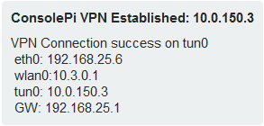

# ConsolePi

!!!!!!!!!!!!!!!!!!!!!!!!!!!!!!!!!! READ ME !!!!!!!!!!!!!!!!!!!!!!!!!!!!!!!!!!!!!!!!!!!!
Problems have been reported with the installer on full raspbian (I did all the testing on raspbian-light (no desktop env)).  The problem is related to ser2net being built from source.  I haven't investigated the issue yet so it's not clear if a change was made to ser2net source... which would indicate the problem would present itself on both the normal and light version of raspbian, or if the issue is specific to the full version.

To work around the issue simply install ser2net via apt.  It won't be as current as the version the installer gets from source, but for the purposes of ConsolePi it has everything we need.

Work-Around Steps
1. sudo apt-get update && sudo apt-get install ser2net
2. sudo mv /etc/ser2net.conf /etc/ser2net.bak
3. Copy contents of src/ser2net.conf in this repo and past into a new /etc/ser2net.conf file
4. sudo nano /etc/ser2net.conf (should be a new file at this point)... Paste in contents of src/ser2net.conf from this repo

Now you can run the installer script below, it will skip over the ser2net config as it's already installed.

!!!!!!!!!!!!!!!!!!!!!!!!!!!!!!!!!!!!!!!!!!!!!!!!!!!!!!!!!!!!!!!!!!!!!!!!!!!!!!!!!!!!!!

Acts as a serial Console Server, allowing you to remotely connect to ConsolePi via Telnet/SSH/bluetooth to gain Console Access to devices connected to ConsolePi via USB to serial adapters (i.e. Switches, Routers, Access Points... anything with a serial port).  Multiple Connectivity options, wired, WLAN (ConsolePi as client or ConsolePi as hotspot), and bluetooth.

*TL;DR:*
Single Command Install Script. Run from a RaspberryPi running raspbian (that has internet access):
`sudo wget -q https://raw.githubusercontent.com/Pack3tL0ss/ConsolePi/master/installer/install.sh -O /tmp/ConsolePi && sudo bash /tmp/ConsolePi && sudo rm -f /tmp/ConsolePi`

------
# Contents
 - [Features](#features)
 - [Installation](#installation)
 - [ConsolePi Usage](#consolepi-usage)
 - [Tested Hardware](#tested-hardware)
 - [Credits](#credits)
------

## Features

**AutoHotSpot**

Script runs at boot (can be made to check on interval via Cron if desired).  Looks for pre-defined SSIDs, if those SSIDs are not available then it automatically goes into hotspot mode and broadcasts its own SSID.  In HotSpot mode user traffic is NAT'd to the wired interface if the wired interface is up.

When ConsolePi enters hotspot mode, it first determines if the wired port is up and has an IP.  If the wired port is *not* connected, then the hotspot distributes DHCP, but does not provide a "Default Gateway" to clients.  This allows a user to dual connect without having to remove a route to a gateway that can't get anywhere.  I commonly use a second USB WLAN adapter to connect to ConsolePi, while remaining connected to the internet via a different SSID on my primary adapter.

If ConsolePi determines there is a wired connection when the hotspot is enabled it forwards (NATs) traffic from clients connected to the hotspot to the wired interface.

**Automatic OpenVPN Tunnel**

When an interface recieves an IP address ConsolePi will Automatically connect to an OpenVPN server under the following conditions:
- It's configured to use the OpenVPN feature, and the ConsolePi.ovpn file exists (an example is provided during install)
- ConsolePi is not on the users home network (determined by the 'domain' handed out by DHCP)
- The internet is reachable.  (Checked by pinging a configurable common internet reachable destination)

 **Automatic PushBullet Notification:**  

*(Requires a PushBullet Account, API key, and the app for mobile devices.)*

When ConsolePi receives a dynamic IP address.  A message is sent via PushBullet API with the IP so you know how to reach ConsolePi.


An additional message is sent once a tunnel is established if the Automatic OpenVPN feature is enabled.



Each Time a Notification is triggered all interface IPs are sent in the message along with the ConsolePi's default gateway(s).

## Installation

If you have a Linux system available you can use the Automated FlashCard imaging script (#3) below to burn the image to a micro-sd, enable SSH, pre-configure a WLAN (optional), and PreConfigure ConsolePi settings (optional).  This script is especially useful for doing headless installations.

**The Following Applies to All Automated Installation methods**

ConsolePi will **optionally** use pre-configured settings for the following if they are placed in the logged in users home-dir when the installer starts (i.e. /home/pi) or in a 'ConsolePi_stage' subdir (i.e. /home/pi/ConsolePi_stage).  This is optional, the installer will prompt for the information if not pre-configured.  It will prompt you to verify either way.

- ConsolePi.conf: This is the main configuration file where all ConsolePi.conf configurable settings are defined.  If provided in the users home dir the installer will ask for verification then create the working config /etc/ConsolePi/ConsolePi.conf

- ConsolePi.ovpn: If using the automatic OpenVPN feature this file is placed in the appropriate directory during the install. *Note: there are a few lines specific to ConsolePi functionality that should be at the end of the file, I haven't automated the check/add for those lines so make sure they are there.  Refer to the example file in the /etc/ConsolePi/src dir*

- ovpn_credentials: Credentials file for OpenVPN.  Will be placed in the appropriate OpenVPN dir during the install.  This is a simple text file with the openvpn username on the first line and the password on the second line.

  *The script will chmod 600 everything in the /etc/openvpn/client directory for security so the files will only be accessible via sudo (root).*

- 10-ConsolePi.rules: udev rules file used to automatically map specific adapters to specific telnet ports.  So every time you plug in that specific adapter it will be reachable on the same telnet port even if other adapters are also plugged in.  Pre-Configuring this is only useful if you are doing a rebuild and already have a rules file defined, it allows you to skip the step in the install where the rules are created by plugging adapters in 1 at a time.

- wpa_supplicant.conf:  If found during install this file will be copied to /etc/wpa_supplicant.  The file is parsed to determine if any EAP-TLS SSIDs are configured, and if so the associated certificate files are also copied to the directory specified in the wpa_supplicant.conf file.  

  The script will look for certs in the following directories (using pi as an example will look in user home dir for any user):

  1.  /home/pi
  2. /home/pi/cert
  3. /home/pi/ConsolePi_stage/cert

- ConsolePi_init.sh: Custom post install script.  This custom script is triggered after all install steps are complete.  It runs just before the post-install message is displayed.


**1. Automatic Installation**

Install raspbian on a raspberryPi and connect it to the network.

The install script below is designed to be essentially turn-key.  It will prompt to change hostname, set timezone, and update the pi users password if you're logged in as pi.

```
sudo wget -q https://raw.githubusercontent.com/Pack3tL0ss/ConsolePi/master/installer/install.sh -O /tmp/ConsolePi && sudo bash /tmp/ConsolePi && sudo rm -f /tmp/ConsolePi
```

**2. Semi-Automatic Install**

Alternatively you can clone this repository, then run the install script.  The only real benefit here would be pre-configuring some of the parameters in the config file:

```
cd /etc
sudo git clone https://github.com/Pack3tL0ss/ConsolePi.git
```

Optionally Pre-Configure parameters, it will result in less time on data-collection/user-input during the install.  Just grab the ConsolePi.conf.example file from the repo, edit it with your settings, and place it in the home dir (for the logged in user: i.e. /home/pi)

```
# example assuming logged in as pi
cd ~/
sudo mv ConsolePi.conf.example ConsolePi.conf
sudo nano ConsolePi.conf
```

Configure parameters to your liking then
ctrl + o  --> to save
ctrl + x  --> to exit
Then run the installer

```
cd /etc/ConsolePi/installer
sudo ./install.sh
```

**3. Automated Flash Card Imaging with AutoInstall on boot**

**Script has been tested and works with USB to micro-sd adapter and sd to micro-sd adapters.**

*This is a script I used during testing to expedite the process Use at your own risk it does flash a drive so it could do harm!*

Using a Linux System (Most distros should work ... tested on Raspbian and Mint) enter the following command:
`curl -JLO https://raw.githubusercontent.com/Pack3tL0ss/ConsolePi/master/installer/ConsolePi_image_creator.sh  && sudo chmod +x ConsolePi_image_creator.sh`

That will download the image creator and make it executable.
Then I would suggest `head -48 ConsolePi_image_creator.sh`, Which will print the top of the file where everything is explained in more detail.  

**ConsolePi_image_creator brief summary:**

*The "Stage dir" referenced below is a sub directory found in the script dir (the directory you run the script from).  The script looks for the Stage dir which needs to be named 'ConsolePi_stage' and moves the entire directory to the pi users home directory.*

The Pre-staging described below is optional, this script can be used without any pre-staging files, it will simply burn the Raspbian-lite image to the micro-sd and set the installer to run automatically on boot (unless you set auto_install to false in the script.  It's true by default)

- automatically pull the most recent raspbian-lite image if one doesn't exist in the script-dir (whatever dir you run it from)
- Make an attempt to determine the correct drive to be flashed, allow user to verify/confirm (given option to display fdisk -l output)
- Flash image to micro-sd card
- PreConfigure ConsolePi with parameters normally entered during the initial install.  So you bypass data entry and just get a verification screen.
- The entire stage dir (ConsolePi_stage) is moved to the micro-sd if found in the script dir.  This can be used to pre-stage a number of config files the script will detect and use, along with anything else you'd like on the ConsolePi image.
- Pre-Configure a psk or open WLAN via parameters in script, and Enable SSH.  Useful for headless installation, you just need to determine what IP address ConsolePi gets from DHCP.
- You can also pre-configure WLAN by placing a wpa_supplicant.conf file in the script dir (or stage dir).  This method supports EAP-TLS with certificates.  Just place the cert files referenced in the provided wpa_supplicant.conf file in either the script dir, or a 'cert' sub-folder or in a cert folder inside the stage dir.  ( Only works for a single EAP-TLS SSID or rather a single set of certs ).
- PreStage all OpenVPN related files (ConsolePi.ovpn and ovpn_credentials) by placing them on the ConsolePi image.  The script will detect them if found in script dir or stage dir.  The installer will then detect them and place them in the /etc/openvpn/client directory.  By default the installer places example files in for OpenVPN (as the specifics depend on your server config).
- create a quick command 'consolepi-install' to simplify the long command string to pull the installer from this repo and launch.
- The ConsolePi installer will start on first login, as long as the RaspberryPi has internet access.  This can be disabled by setting auto_install to false in this script.

Once Complete you place the newley blessed micro-sd in your raspberryPi and boot.  The installer will automatically start unless you've disabled it.  In which case the `consolepi-install` will launch the installer.

**4. Manual Installation**

Manual installation instructions are incomplete at the moment

For the brave or curious... Instructions on how to manually install can be found [here](readme_content/ConsolePi - Manual Installation.md).

## ConsolePi Usage:

**Configuration:**

The Configuration file is validated and created during the install.  Settings can be modified post-install via the configuration file /etc/ConsolePi.conf

**Console Server:**

- Serial/Console adapters are reachable starting with telnet port 8001 +1 for each subsequent adapter plugged in (8002, 8003...).  If you are using a multi-port pigtail adapter or have multiple adapters plugged in @ boot, then it's a crap shoot which will be assigned to each telnet port.  Hence the next step.
- The install script automates the mapping of specific adapters to specific ports.  The defined predictable adapters start with 7001 +1 for each adapter you define.  The reasoning behind this is so you can label the adapters and always know what port you would reach them on.  Key if you are using a  multi-port pig-tail adapter, or if this is going to be stationary and occasionally boot up with multiple adapter plugged in.  

Note: the 8000 range always valid even if you are using an adapter specifically mapped to a port in the 7000 range.  So if you plug in an adapter pre-mapped to port 7005, and it's the only adapter plugged in, it would also be available onport 8001

- Port monitoring/and control is available on telnet port 7000.  This allows you to change the baud rate of the port on the fly without changing the config permanantly.  The installer configures all ports to 9600 8N1. 
- Serial Port configuration options can be modified after the install in /etc/ser2net.conf 

**Convenience Commands:**

There are a few convenience commands created for ConsolePi during the automated install

- consolepi-upgrade:  Upgrades ConsolePi:  More useful in the future.  Currently bypasses upgrade of ser2net (it's compiled from source).  I'll eventually remove the bypass.  For now this is essentially the same as doing a 'sudo git pull' from /etc/ConsolePi and updating/upgrading the other packages via apt.  Note: in it's current form it may overwrite some custom changes.  It's only lightly been tested as an upgrade script.
- consolepi-addssids:  runs the /etc/ConsolePi/installer/ssids.sh script.  This script automates the creation of additional SSIDs which ConsolePi will attempt to connect to on boot.  Currently only supports psk and open SSIDs, but may eventually be improved to automate creation of other SSID types.
- consolepi-addconsole: runs the /etc/ConsolePi/installer/udev.sh  This script automates the process of detecting USB to serial adapters and mapping them to specific telnet ports.  It does this by collecting the data required to create a udev rule.  It then creates the udev rule starting with the next available port (if rules already exist).
- consolepi-autohotspot: runs /usr/bin/autohotspotN script  This script re-runs the autohotspot script which runs at boot (or periodically via cron although the installer currently doens't configure that).  If the wlan adapter is already connected to an SSID it doesn't do anything.  If it's acting as a hotspot or not connected, it will scan for known SSIDs and attempt to connect, then fallback to a hotspot if it's unable to find/connect to a known SSID. 
- consolepi-killvpn: gracefully terminates the OpenVPN tunnel if established.
- consolepi-menu: Launches ConsolePi Console Menu, which will have menu items for any serial adapters that are plugged in.  This allows you to connect to those serial adapters.  This menu is launched automatically when connecting to ConsolePi via BlueTooth, but can also be invoked from any shell session (i.e. SSH)


## Tested Hardware

ConsolePi Should work on all variants of the RaspberryPi, but it has been tested on the following: 

​	*If you find a variant of the Rpi that does not work, post a comment to the discussion board*

- RaspberryPi 3 Model B+
  - Tested with RaspberryPi Power supply, PoE Hat, and booster-pack (battery), all worked fine *other than the known over-current errors on the original PoE Hat - still wored on my PoE switch*
- RaspberryPi zero w
  - With both single port micro-usb otg USB adapter and multi-port otg usb-hub
  *I did notice with some serial adapters the RaspberryPi zero w Would reboot when it was plugged in, this is with a RaspberryPi power-supply.  They work fine, it just caused it to reboot when initially plugged-in*

## CREDITS

ConsolePi utilizes a couple of other projects so Some Credit

1. **AutoHotSpotN** ([roboberry](http://www.raspberryconnect.com/network/itemlist/user/269-graeme))

   Network Wifi & Hotspot with Internet
   A script to switch between a wifi network and an Internet routed Hotspot
   A Raspberry Pi with a network port required for Internet in hotspot mode.
   Works at startup or with a seperate timer or manually without a reboot
   Other setup required find out more at
   http://www.raspberryconnect.com

   *ConsolePi Provides the source script for AutoHotSpotN as there are minor modifications to the script for some ConsolePi functionality*

2. **ser2net** ([cminyard](http://sourceforge.net/users/cminyard))

   This project provides a proxy that allows telnet/tcp connections to be made to serial ports on a machine.

   https://sourceforge.net/projects/ser2net/

   https://github.com/cminyard/ser2net

   *The ser2net available from apt works and has been tested, the installation script pulls the far more current version from sourceforge and compiles/installs it and builds the config*


