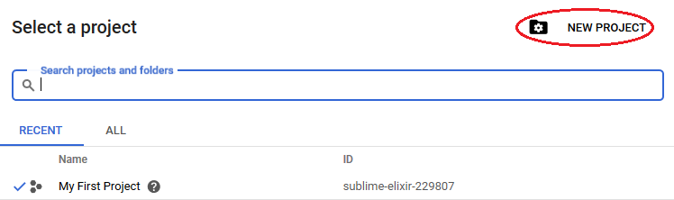

# Google Drive | Google Sheets Setup for ConsolePi cloud/clustering feature

## Create Project

- Go To https://console.developers.google.com/ login to your google account if not already
- Create a new Project and name it "ConsolePi"




* Name the new project ConsolePi
* Click "+ ENABLE API AND SERVICES" at the top of the ConsolePi dashboard and add the following:
  * Google Sheets API
  * Google Drive API
* Select "Credentials" from the left menu and "Create Credentials"
  * Select credential type: "OAuth Client ID"
  * Application Type: Other
  * Name the client "ConsolePi" (actually don't think this one matters)

You'll get a window with a Client ID and Client secret.  You can close that window.  Then on the credentials page you'll have the option to download the json file used by ConsolePi


Rename the resulting file ```credentials.json```

## Authorize ConsolePi

Before ConsolePi can leverage the Google APIs to update the spreadsheet, we will need to Authorize the script.

* First place the ```credentials.json``` file retrieved from the developers console in ```/etc/ConsolePi/cloud/gdrive/.credentials``` directory.  

  *Notice the dot prepending the credentials directory, it won't show up in directory listings unless you do an ```ls -a```, and won't appear in the GUI file browser unless the option to display hidden files and folders is enabled.*

##### **If you have installed Raspbian with a full desktop:**

- Login to a desktop (GUI) session on Raspbian and open a terminal window.

- issue the ```consolepi-menu``` command.  Then select the option to refresh cloud data.  This will start the script, which needs authorization the first time it is ran (on each ConsolePi)

  - A browser should open prompting you to login and authorize the permissions being requested by the app. 

  - You should end up with 2 files in the ```/etc/ConsolePi/cloud/gdrive/.credentials``` directory.

    ​	```.credentials.json```

    ​	```token.pickle```

  Those 2 files can be copied to any other ConsolePis you want to be part of your cluster.  So you won't have to go through the Authorization process on subsequent ConsolePis.

##### **If you have installed Raspbian-lite (no desktop environment):**

For ConsolePis using Raspbian-lite there is no desktop environment, so you can't authorize the app to use the API.  The script will present a link, but that link needs be used on the actual ConsolePi not a separate system.

To get around this I've provided a Windows compatible exe (created and tested on Win 10) that includes the get_credentials function from the gdrive.py script.  This was bundled for Windows using pyinstaller so no other software is required to run it.

- download the exe from: https://github.com/Pack3tL0ss/ConsolePi/tree/Clustering/cloud/gdrive/headless-auth

  The file is the ```gdrive-ConsolePi-headless-auth-win.exe```  *Right Click and "save link as" or similar*

- Place the ```credentials.json``` file in the same directory as the executable on a Windows system and double click the ```gdrive-ConsolePi-headless-auth-win.exe```

  - This should cause a browser to launch and present the Authorization flow. 

  Once Complete you should have a new token.pickle file in the same directory.

* Move both files credentials.json and token.pickle to the ```/etc/ConsolePi/cloud/gdrive/.credentials``` folder on the ConsolePi

  *Notice the dot prepending the credentials directory, it won't show up in directory listings unless you do an ```ls -a```, and won't appear in the GUI file browser unless the option to display hidden files and folders is enabled.*

* Login to the ConsolePi and issue the ```consolepi-menu``` command.  Then press the option to update the cloud config.  


##### **Verification**

- Login to your Google Drive account and look for ```ConsolePi.csv``` in the root folder.  It will be created automatically by the first ConsolePi, and rows should exist for any ConsolePis that are connected.

- Logs are sent to /var/log/ConsolePi/cloud.log

- You should have entries for any ConsolePis that have used the menu to update.

  *Note: An update will also occur automatically anytime the ConsolePi get's an IP address and can reach the internet*

  **The Hostname is the unique identifier for the ConsolePi.  So they should be unique.  This was done on purpose.  I could have used the MAC, but that would be less meaningful in the menu.  In the menu the connections are identified by the hostname and port alias (if aliases were configured).  It's crucial to set unique hostnames, otherwise they will overwrite each others row in the spreadsheet and this feature won't work.**
