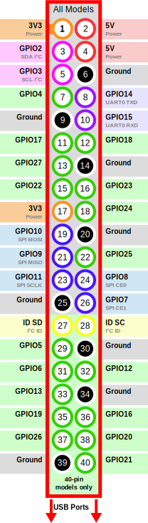

## Power Control

The Power Control Function allows you to control power to external outlets.  ConsolePi supports:
  - [digital Loggers](https://www.digital-loggers.com/index.html) Ethernet Power Switch/Web Power Switch (including older models lacking rest API).
  - External relays controlled by ConsolePi GPIO ( Like this one [Digital-Loggers IoT Relay](https://dlidirect.com/products/iot-power-relay) ).
  - [espHome](https://esphome.io) flashed WiFi smart outlets (i.e. SonOff S31).  These are low cost outlets based on ESP8266 / ESP32 microcontrollers.
  - [Tasmota](https://blakadder.github.io/templates/) flashed WiFi smart [outlets](https://blakadder.github.io/templates/) These are also esp8266 based outlets similar to espHome.
      > espHome/Tasmota were chosen because it allows for local control without reliance on a cloud service.  So your 'kit' can include a small relatively portable smart outlet which can be programmed to connect to the ConsolePi hotspot.  Then ConsolePi can control that outlet even if an internet connection is not available.
- If the function is enabled and outlets are defined, an option in `consolepi-menu` will be presented allowing access to a sub-menu where those outlets can be controlled (toggle power on/off, cycle).
- Outlets can be linked to Console Adapter(s) (best if the adapter is pre-defined using `consolepi-addconsole` or `rn` option in the menu) or manually defined host connections.  If there is a link defined between the outlet and the adapter/host, anytime you initiate a connection to the adapter/host via `consolepi-menu` ConsolePi will ensure the outlet is powered on.  Otherwise if the link is defined you can connect to a device and power it on, simply by initiating the connection from the menu **Only applies when connecting via `consolepi-menu`**.
    > The power sub-menu **currently** only appears in the menu on the ConsolePi where the outlets are defined (Menu does not display outlets defined on remote ConsolePis).  The auto-power-on when connecting to an adapter linked to an outlet works for both local and remote connections (establishing a connection to an adapter on a remote ConsolePi (clustering / cloud-sync function) via another ConsolePis menu)

### Power Control Setup

After enabling via `consolepi-upgrade` or during initial install; The `POWER:` section of `ConsolePi.yaml` needs to be populated, see `ConsolePi.yaml.example` for formatting.
The POWER: section of ConsolePi.yaml should look something like this:
```
POWER:
  cloud_lab:
    address: 10.0.230.10
    type: tasmota
    no_all: true
  gpio_outlet1:
    address: 4
    linked_devs: ofc-2930F-sw
    type: GPIO
  outlet1:
    address: outlet1.kabrew.com
    type: esphome
    relays: outlet1
    linked_devs:
      Orange6: outlet1
  powerstrip1:
    address: powerstrip1.kabrew.com
    type: esphome
    relays: [relay1, relay2, relay3, relay4]
    linked_devs:
      AP-SERU: relay1
      r2-6200f-sw: [relay3, relay4]
  labpower1:
    type: dli
    address: labpower1.example.com
    username: admin
    password: "C0nS0L3P!TisTheShit"
    linked_devs:
      Lr1-5900T-sw(Console): [1, 6]
      Lr1-5900B-sw(Console): [1, 6]
      Lr1-5900T-sw(ssh): 6
      Lr1-5900B-sw(ssh): 6
      Lr1-8320T-sw(oobm): [1, 2]
      Lr1-8320B-sw(oobm): [1, 2]
      Lr1-8320T-sw(Console): [1, 2]
      Lr1-8320B-sw(Console): [1, 2]
      Lr1-6300M-sw(oobm): 8
      Lr1-6300M-sw(in-band-mgmt): 8
      6300T: 8
      6300B: 8
  labpower2:
    type: dli
    address: labpower2.example.com
    username: admin
    password: "fakepass"
```
The example above assumes you have adapters (aliases) or have host definitions for the linked_devs ('ofc-2930F-sw' ...).  For the adapter aliases You can use `consolepi-addconsole` or the `rn` (rename) option in `consolepi-menu` to create the aliases.

> You could link the root devices i.e. ttyUSB0 or ttyACM0 to an outlet.  This will work if there is no alias configured for the adapter.  The predictable aliases just ensure the outlet is linked to a specific physical adapter, where the root devices essentially links the outlet to whichever adapter was plugged in first.  In either case the function only powers ON the outlet automatically.  It will **not** power OFF a device. The power sub-menu provides full on|off|cycle capabilities for the ports.


explanation of keys:
```
POWER: <-- required section header
  unique_name_for_outlet_grp: [required] ... this is how the outlet is described in the power sub-menu
    type: [required, valid values = GPIO, tasmota, dli]
    address: [required, GPIO pin (BCM numbering) if type is "GPIO" OR ip address/fqdn if type is "tasmota" or "dli"]
    noff: [optional (bool) applies to GPIO default is true] ... indicates if outlet is normally off (true) or normally on (false)
    no_all: [optional (bool)] ... indicates this outlet should *not* be included in 'all <on|off|cycle>' operations.
    relays: [required and only applies to espHome outlets] ... This is the `name` of the relay being controlled (see espHome section below)
    username: [required for dli] username used to access the dli
    password: [required for dli] password used to access the dli - use quotes if special characters such as `:` are in the password.
    linked_devs: [optional] adapter or host that is linked or a list of adapters hostnames if multiple linked to same outlet
                            for dli the format is: linked-dev-name: port (or [port, port, port] for linking single device to multiple ports)
```
> You can link a single dev to multiple outlets/outlet-types, you can also link the same outlet to multiple devices/hosts.

#### GPIO Connected Relays
- For GPIO controlled relays: The trigger on the relay should be connected to GPIO ports.  Trigger(+) to one of the GPIO pins, Trigger(-) to one of the GPIO ground pins.
- ConsolePi expects the GPIO number not the Board pin # in the `POWER:` section of `ConsolePi.yaml`.  For example given the GPIO layout for the Raspberry Pi below.  Board Pin # 7 = GPIO 4.  `ConsolePi.yaml` should be populated with 4.
> The Power Control Function supports relays with outlets that are 'normally on' or 'normally off'.  A 'normally off' outlet will not apply power until told to do so by ConsolePi (voltage applied to Trigger).  A 'normally on' outlet works the opposite way, it will have power with no voltage on the trigger, meaning it would be powered even if there is no connection to the ConsolePi.  It only powers off the outlet if ConsolePi applies voltage.
>
> *A 'normally off' outlet will revert to powered off if ConsolePi is powered-off, disconnected, or rebooted, inversely a 'normally on' outlet will revert to a powered-on state if ConsolePi is powered-off, disconnected, or rebooted.*  The default is 'normally off', use `noff: false` for 'normally on' outlets.




#### espHome Flashed WiFi Smart Outlets
- You'll need a WiFi smart outlet running espHome.  There are plenty of resources online to help with that.
- The one requirement from an espHome standpoint is to enable the local web-server via
```
# Enable Local Web Server  ## THIS IS NOT FOR ConsolePi.yaml, it's for espHome config used to build Binary ##
web_server:
  port: 80
```
*This is done in the yaml file used to compile the binary for flashing the espHome device*

- You can control the outlet as long as ConsolePi can reach it (IP).
- When setting the outlet to connect to ConsolePi via hotspot, it's best to configure a DHCP reservation so it is assigned the same IP everytime.  This way the IP in ConsolePi.yaml is always valid.

To add a DHCP reservation you'll need to determine the MAC address of the smart-outlet.  If you're not sure what the MAC is, you can run `tail -f /var/log/syslog | grep DHCPACK`.  Then power on the smart-outlet.  Once it connects and gets DHCP you should see a log with the MAC.  Then use <ctrl+c> to break out of `tail -f`.
To Create the reservation add a file in either `/etc/ConsolePi/dnsmasq.d/autohotspot/` (`/etc/dnsmasq.d/` if your ConsolePi was deployed before the change to a ConsolePi specific dnsmasq instance) directory called something like `smartoutlets`
```
sudo nano /etc/ConsolePi/dnsmasq.d/autohotspot/smartoutlets
```
Then in nano add something like the following:
```
#Outlet A
dhcp-host=b4:e6:2d:aa:bb:99,outleta,10.3.0.11
```
repeat as needed for multiple outlets.

Then the `POWER:` section of your `ConsolePi.yaml` would include something like this:
```
POWER:
  cloud_lab:
    address: 10.0.230.10
    type: tasmota
    no_all: true
  outlet1:
    address: outlet1.example.com
    type: esphome
    relays: outlet1
    linked_devs:
      Orange6: outlet1
  powerstrip1:
    address: 10.0.10.123
    type: esphome
    relays: [r2_6400_mml-sw, r2_6400_mmr-sw, another-one, and-another]
    linked_devs:
      r2_6400L-sw: r2_6400_mml-sw
      Orange6: [outlet_4, another_outlet]
```
The example above highlights the following.  Outlet `cloud_lab` has the `no_all` key set to `true`, it will be excluded from any `all` operations available in the menu (`all on`, `all off`, `cycle all`).  It also highlights A multi-port power-strip, and a single port device.  With espHome there is a `relays:` key in the config where the relays are defined.  The values should match the name (with some conversion rules explained below) configured in the yaml used to compile the binary flashed to the device, for example this is a snippet from the config used to build the binary for powerstrip1 above:
```
### THIS IS NOT AN EXAMPLE FOR ConsolePi.yaml, This is an example for espHome, more details found on espHome's site
switch:
  - platform: gpio
    name: "R2-6400 MML-sw"
    id: relay1
    icon: "mdi:power-socket-us"
    pin:
      number: GPIO13
  - platform: gpio
    name: "R2-6400 MMR-sw"
    id: relay2
    icon: "mdi:power-socket-us"
    pin:
      number: GPIO12
```
Notice the `name` of the relay from the esphome config is what is configured as `relays:` in ConsolePi.yaml with the following conversion rules.

  - convert to all lower case
  - replace any spaces with underscores

Beyond that similar to other outlet types you can link a device with a single outlet/relay or multiple.  You can also specify the same device across multiple controlled outlets/power-strips.  `Orange6` above will lead to `outlet1` as well as `outlet_4` and `another_outlet` on powerstrip1 all being toggled ON when connecting to Orange6 via the menu.


#### Tasmota Flashed WiFi Smart Outlets
> Note: I only tested Tasmota with single outlet devices, never with a multi-relay device like a power strip.  So support for Tasmota at the moment is for single port devices.  espHome which should be supported on the same devices Tasmota is supported on does have support for power-strips.
- You'll need a WiFi smart outlet running Tasmota.  There are plenty of resources online to help with that.  You should start [here](https://blakadder.github.io/templates/)
- You can control the outlet as long as ConsolePi can reach it (IP).
- When setting the outlet to connect to ConsolePi via hotspot, it's best to configure a DHCP reservation so it is assigned the same IP every time.  This way the IP in ConsolePi.yaml is always valid.  *some instructions on how that is done can be found above in the espHome section*


Then the `POWER:` section of your `ConsolePi.yaml` would include something like this:
```
POWER:
  OutletA:
    type: tasmota
    address: 10.3.0.11
    linked_devs: [Aruba2930F_cloud-lab, SDBranchGW1_cloud-lab]
```

#### DLI Web/Ethernet Power Switch

Just add the definition for the dli in power.json which should look something like this:
```
POWER:
  labpower1:
    type: dli
    address: labpower1.example.com
    username: apiuser
    password: redacted
    linked_devs:
      2530IAP: [5, 6]
  labpower2:
    type: dli
    address: labpower2.example.com
    username: apiuser
    password: redacted
    linked_devs:
      2530IAP: 8
      Aruba6300: 8
  dli_with_no_linked_outlets:
    type: dli
    address: 10.0.30.71
    username: apiuser
    password: redacted
```
**The Above Example highlights different options**
- Outlet Group "labpower1" has multiple ports linked to a single adapter.  Both ports would be powered on when connecting to that adapter.
- Outlet Group "labpower2" has a single port linked to multiple adapters.  Connecting to either adapter via the menu will result in the port being powered
- The /dev/ prefix is optional.
- This function will work for adapters or manually defined hosts (see below)
- The last Outlet Group defines the dli, but has no linkages.  This outlet group won't appear in the power menu invoked by 'p', but dlis have their own dedicated menu 'd' that displays all ports on the dli.
- Notice `2530IAP` is linked in 2 different outlet groups, meaning a connection to 2530IAP will power on labpower1 port 5 and 6, as well as, labpower2 port 8.